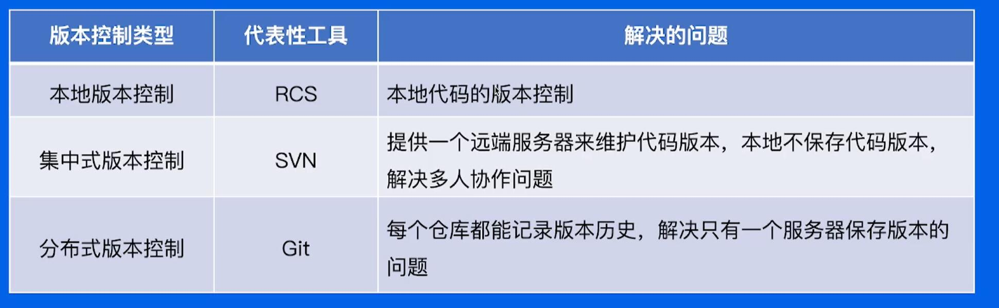
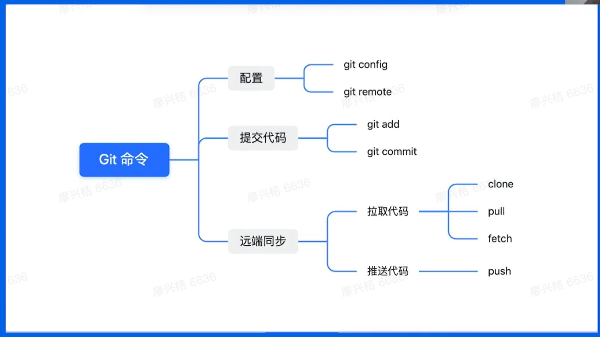
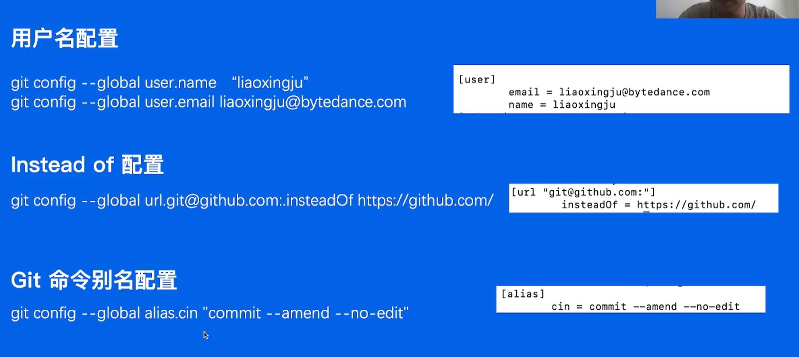
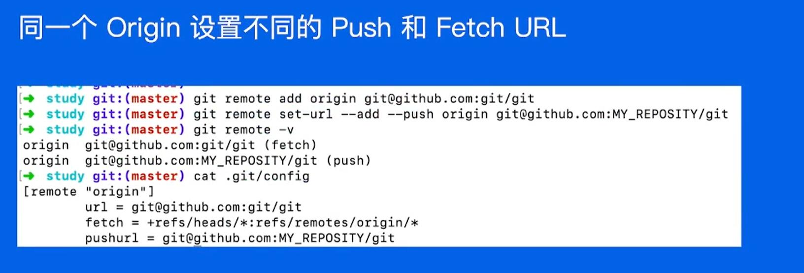
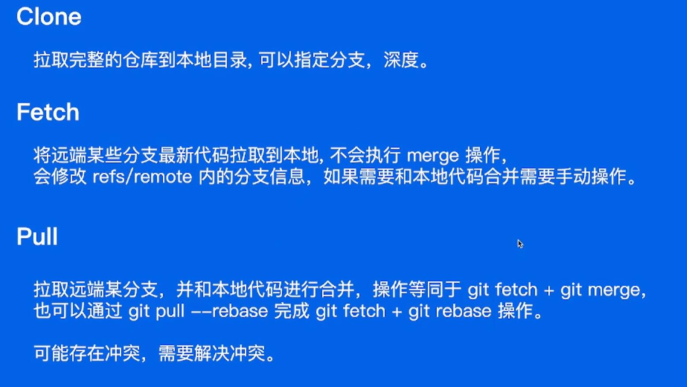

## git的使用

### 

### git command

- tree dir : 查看目录结构  tree .git

#### git配置
git config

常见的git配置

#### git remote

- 查看Remote `git remote -v`
- 添加Remote   
  `git remote add origin_ssh git@github.com:git/git.git`   
  `git remote add origin_http https://github.com/git/git.git`

#### HTTP remote

一般用ssh remote

#### SSH remote

生成key  
`ssh-keygen -t ed25519 -C "cz77788881@163.com"`

#### git add

插曲 : 查看git 文件信息 ` git cat-file -p fbeb4b00d1bb29a9e438599cce346cabc6f78b36` (查看某些信息要加前面的文件名才是完整的文件)

#### refs 

- 新建分支 `git checkout -b test`
- tag 表示稳定的版本 `git tag v012`

#### annotation tag 附注标签
- 创建 `git tag -a`

#### 获取历史版本

#### 修改历史版本

- commit --amend  可修改最近一次的commit信息, 修改后 commit id 会变
- rebase 通过`git rebase -i HEAD~3`可以实现对最近三个commit的修改
  - 合并commit
  - 修改具体的commit message
  - 删除某个commit
- filter --branch 可以指定删除所有提交中的某个文件,或者全局修改邮箱地址等操作

#### object

- 查找悬空的commit `git fsck --lost-found`
- git gc 可以删除一个不要的object

#### git clone & pull & fetch

#### git push

常用命令 `git push origin master`

冲突问题
1. 如果本地的commit记录和远端的commit 历史不一致, 则会产生冲突, 比如`git commit --amend` 或者 `git rebase`都可能导致这个问题
2. 如果该分支只有自己使用, 可通过 `git push origin master -f` 强制推送

### git研发流程

#### merge

