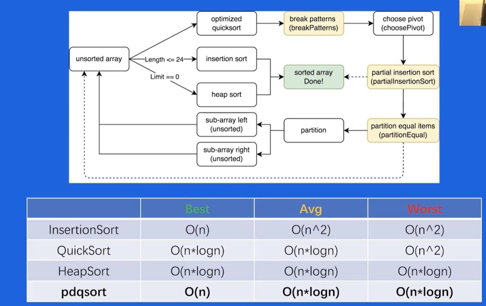

## 经典排序算法

### pdqsort 
pattern-defeating-quicksort

不稳定的混合排序算法

1. **v1** 
  - 短序列使用插入排序   短序列具体长度选 24
  - 整体用快排
  - 快排不好时用堆排
    - 如何判断快排表现不佳?
    - 当最终pivot的位置离序列两端很接近时(距离小于lenth/8)判定表现不佳, 当这种情况出现次数到达limit时(bits.Len(length)), 切换到堆排序

2. **v2**
  - 改进快排
    - 选择pivot 
      - 中序列(<=50)采样3个元素中的中位数 
      - 长序列采样9个 选中位数
  - pivot的采样可以对序列的顺序做出一个大致的判断
    - 采样元素都是逆序排列==>序列可能已经逆序==>翻转整个序列
    - 都是顺序排列-->可能已经有序==>使用插入排序
      - 插入排序实际使用partialInsertionSort, 即有限制此鼠的插入排序  
3. **v3 final version** 
  - 如何优化重复元素很多的情况?
    - 采样pivot时检测重复度?
      - 不好, 采样数有限
    - 如果两次partition生成的pivot相同,即partition进行了无效分割, 此时认为pivot的值为重复元素
  - 当检测到此时的pivot和上次相同时,使用partitionEqual将重复的元素排列在一起, 减少重复元素对于pivot选择的干扰
  - 优化: 当pivot选择策略不佳时,随机交换元素
    - 避免一些极端情况(比如逆序很多)使得QuickSort表现不佳,以及黑客攻击的情况

