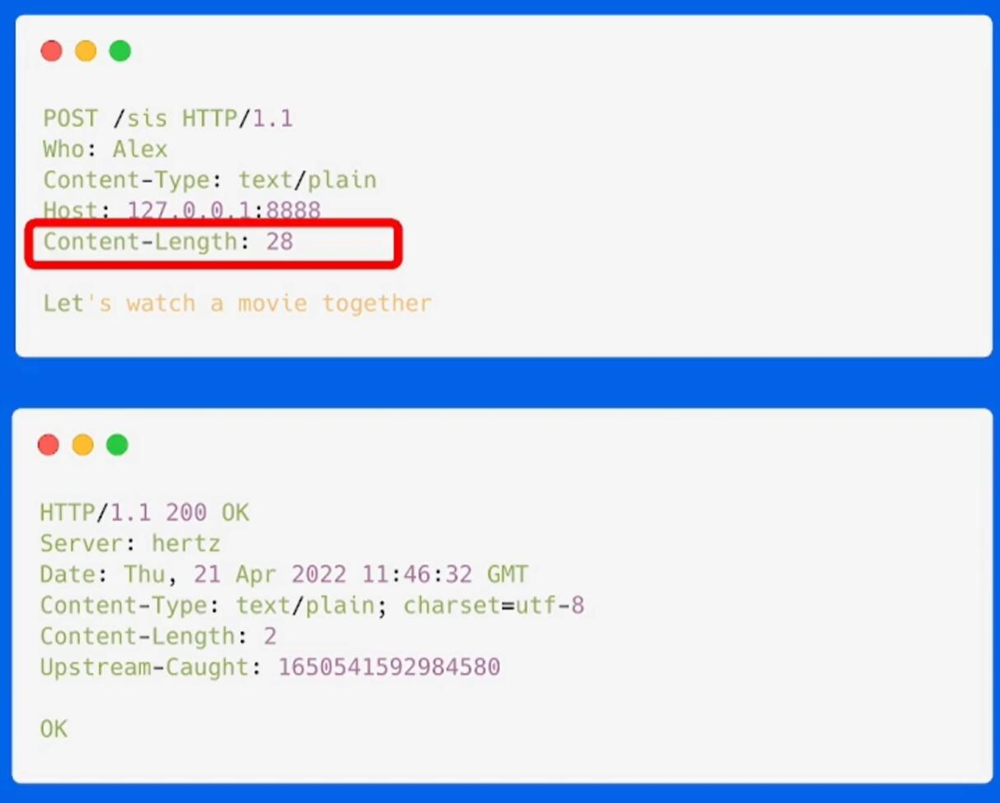
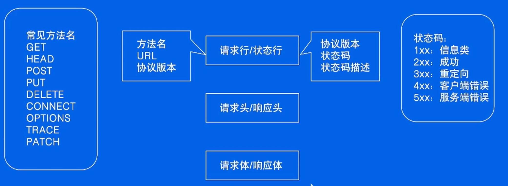
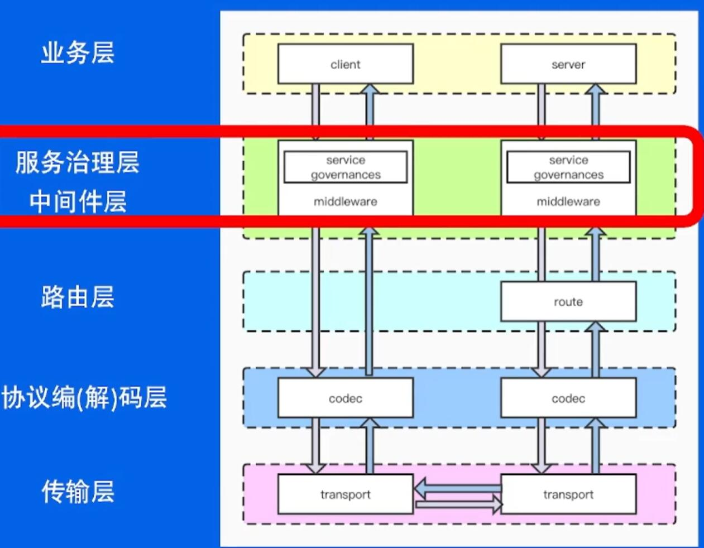
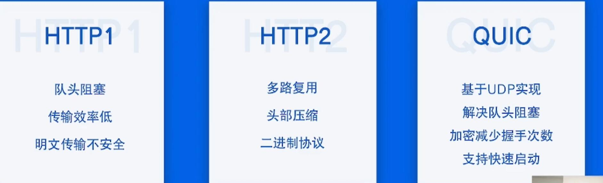
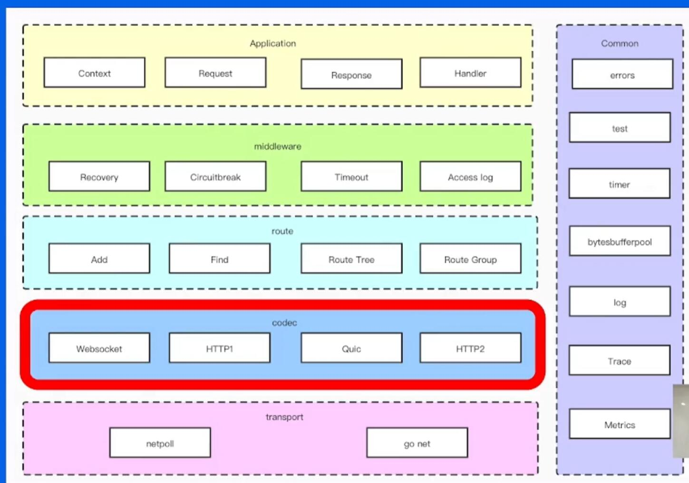

[TOC]

## http框架

### 再谈http协议

- http是啥

Hypetext transfer Protocol

- 协议内容

- 请求流程

- 不足与展望

### http框架的设计与实现

分层设计

从一个切切实实的简单系统开始

- 中间件设计
  - 洋葱模型
  - 类似 gin中的中间件

- 路由设计 匹配
  - 青铜 map[string]handlers
  - 黄金 前缀匹配树  
  
- 协议层设计 抽象出合适的接口

- 网络层设计
  - BIO
  - NIO
  
### 性能

1. 针对网络库的优化

2. 针对协议的优化
   1. headers 解析
     找到Header Line 边界, \r\n
     先找到 \r, 看下一个是不是\n --- SIMD
   2.  ASD 
   3.  热点资源池化

### 企业实践
