## 微服务架构原理与治理实践

微服务架构是大多数公司的标准架构

### 微服务架构介绍

- 系统架构演进历史
  单体架构->>垂直应用架构 ->> 分布式架构 ->> SOA架构 -->微服务架构

  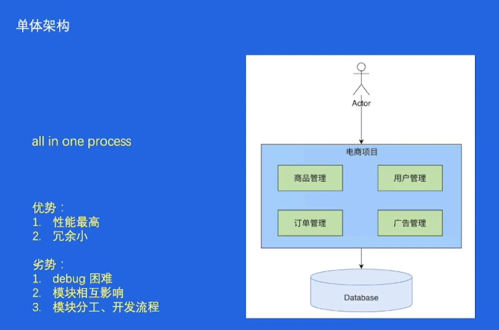
  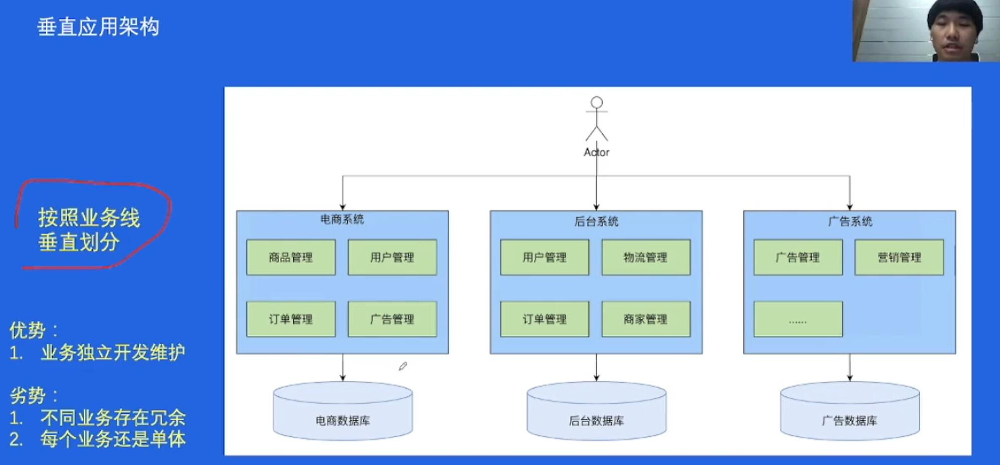
  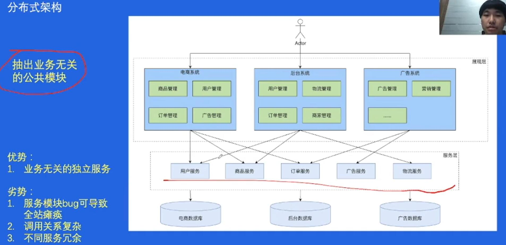
  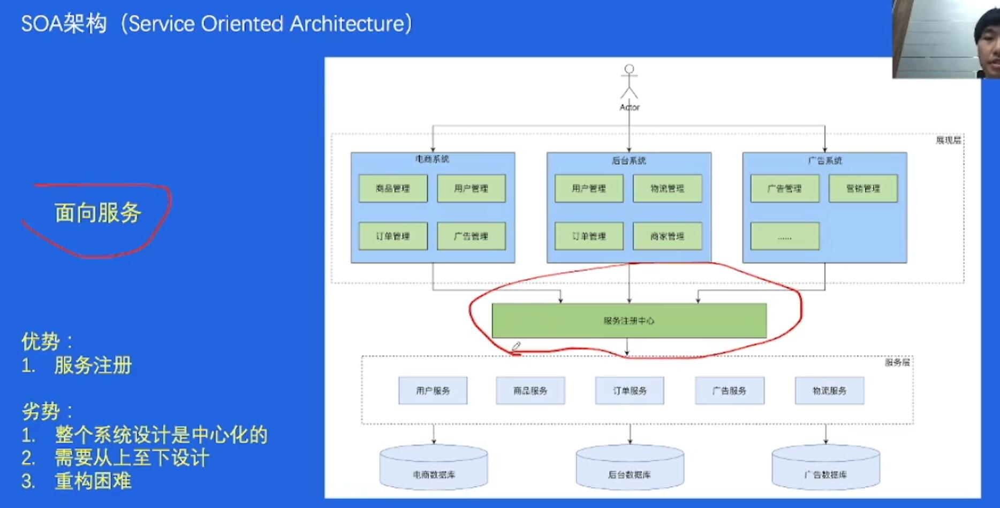
  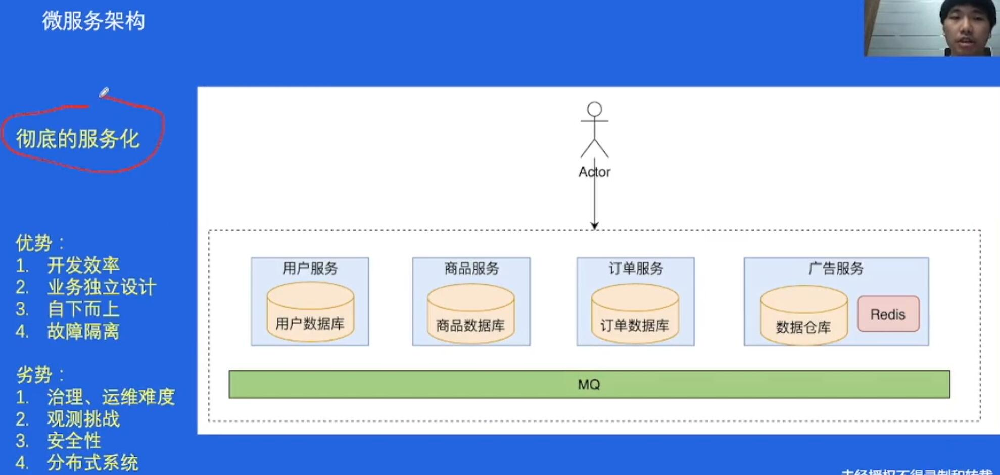
- 微服务架构
  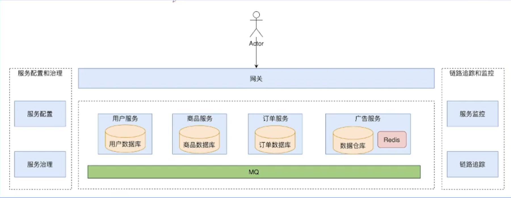
- 微服务架构核心要素
  - 服务治理
  - 可观测性
    - 日志采集
    - 日志分析
    - 监控打点
    - 监控大盘
    - 异常报警
    - 链路追踪
  - 安全

### 微服务架构原理及特征

1. 基本概念
   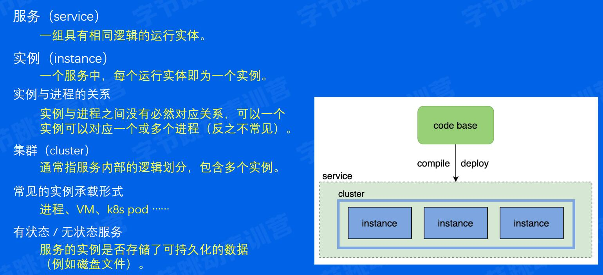

   服务间通信
   - 单体服务：简单的函数通信
   - 微服务: 网络传输 protocols: http thrift gRPC等

2. 服务注册及发现
   问题 : 在代码层面如何指定一个请求?
   - ip:port? 只会给一个实例发请求, 而且ip会变
     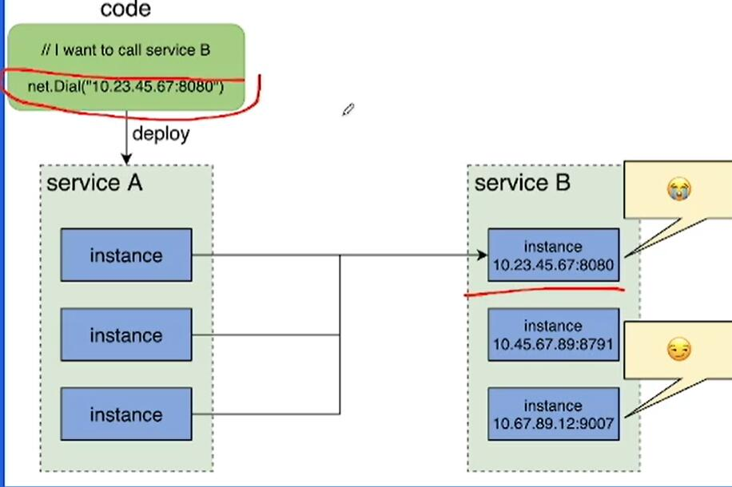
   - DNS? 
     - 本地dns存在缓存, 导致延迟 
     - 负载均衡问题
     - 不支持服务实例的探活机制
     - 域名无法配置端口
     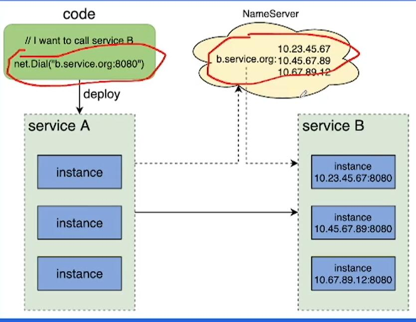
   - 新建一个统一的服务注册中心
3. 流量特征
  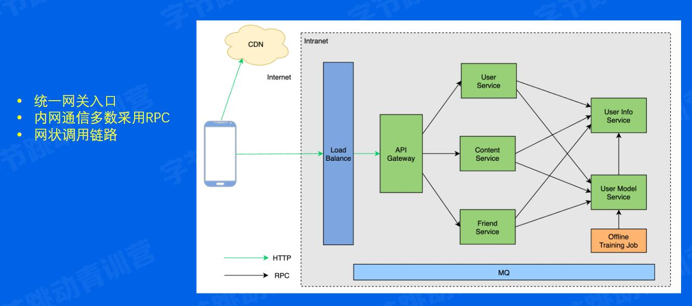

### 核心服务治理功能

1. 服务发布
  - 服务发布的难点
     - 服务不可用
     - 服务抖动
     - 服务回滚 : 有bug  回滚上一版本
  - 蓝绿部署: 停一半, 更新一半
    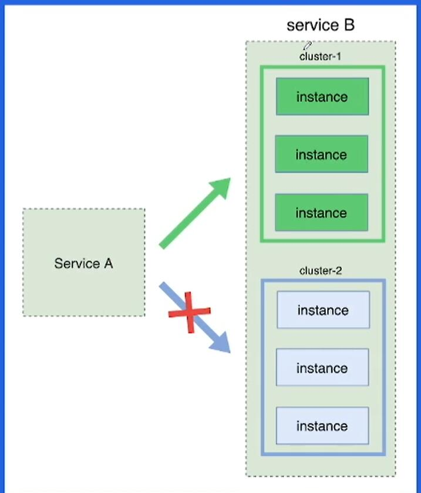
  - 灰度发布(金丝雀发布): 一点试, 逐渐扩大
2. 流量治理
  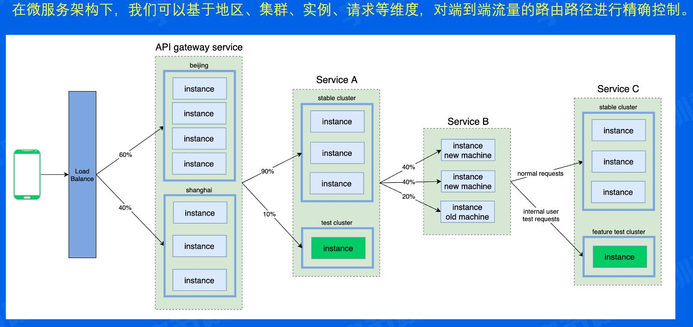
3. 负载均衡
   类似os调度
4. 稳定性治理
    外部因素
    应对: 限流 熔断 过载保护   降级
    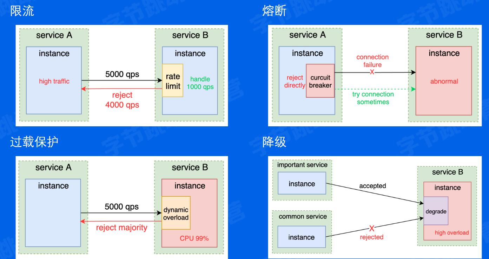

### 字节服务治理实战
重试的意义
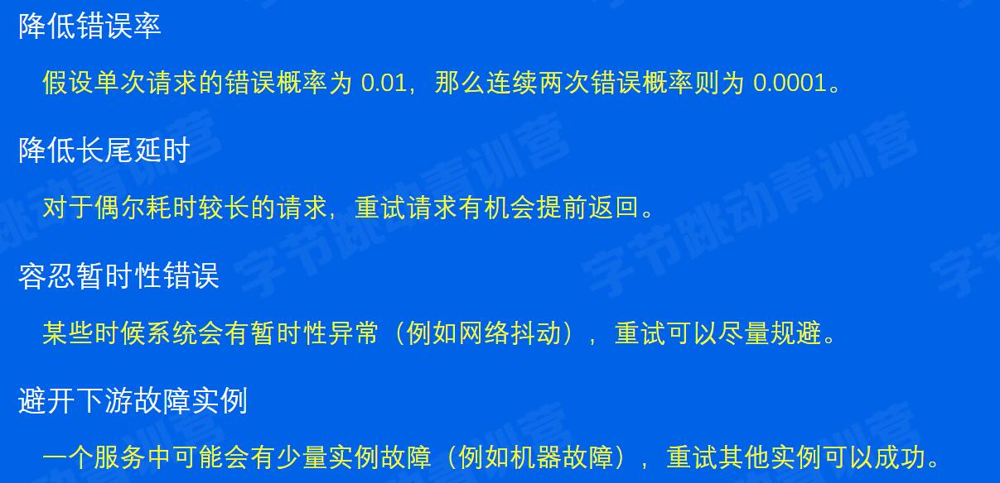

重试的难点
  重试好用, 为什么默认不用?
  - 幂等性
  - 重试风暴
  - 超时设置
  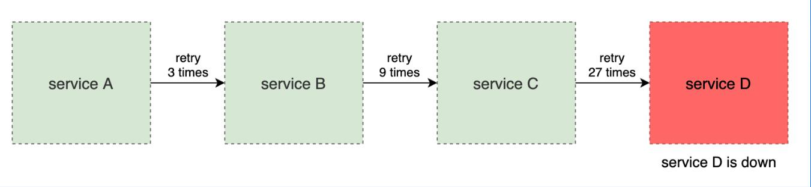