## 走进消息队列

四个问题
  - 系统崩溃
  - 服务处理能力有限
  - 链路耗时长尾
  - 日志如何处理

解决-通过消息队列
  - 解耦
    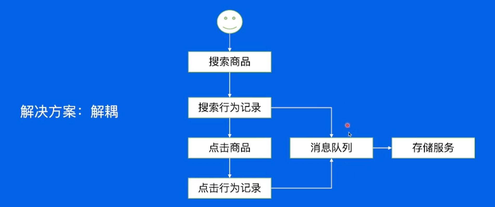
  - 削峰
    
  - 异步
    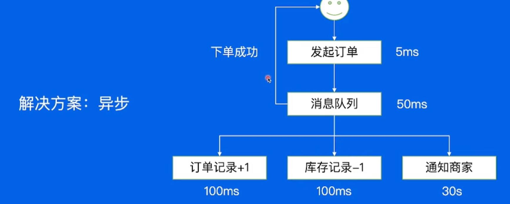

**消息队列(MQ)** : 指保存消息的一个容器,本指是个队列, 但这个队列需要支持高吞吐, 高并发, 并且高可用

### 前世今生
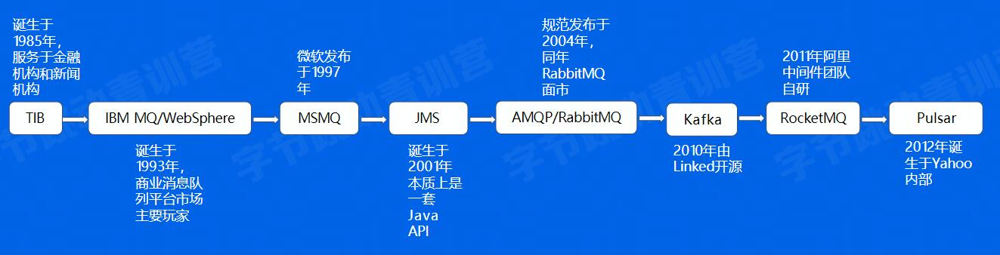

业界消息队列对比

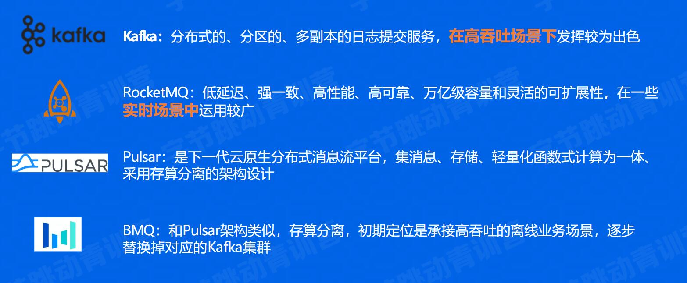

### 消息队列-Kafaka

1. 使用kafka  :
   创建集群->新增topic->编辑生产者逻辑->编辑消费者逻辑

2. 基本概念
  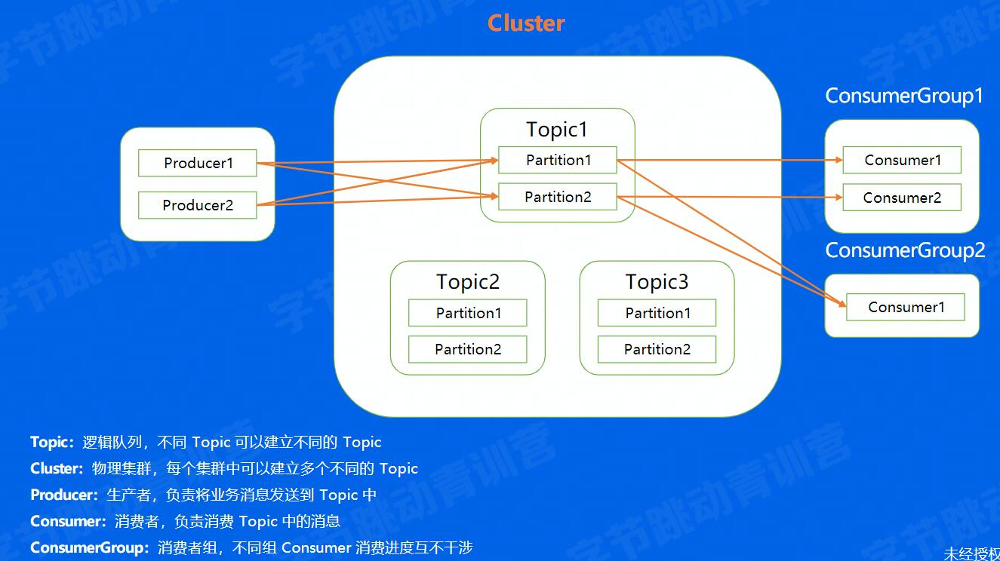
  - offset: 消息在partition内部的偏移
3. 数据复制 replica(副本):容灾
    follower和leader保持一定的差距, 差距过大时就会被踢出ISR, 当leader宕机时, 选择follower作为新的leader
    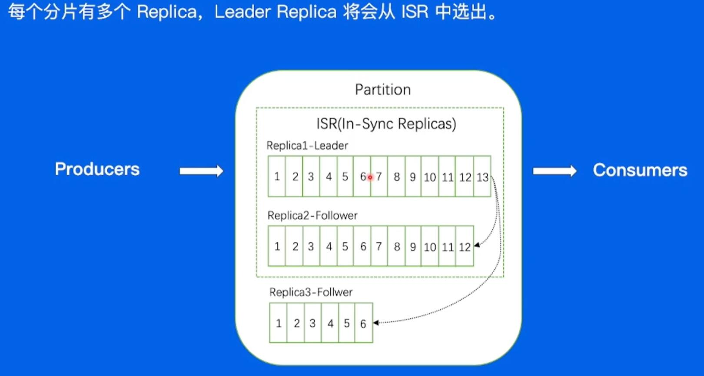
    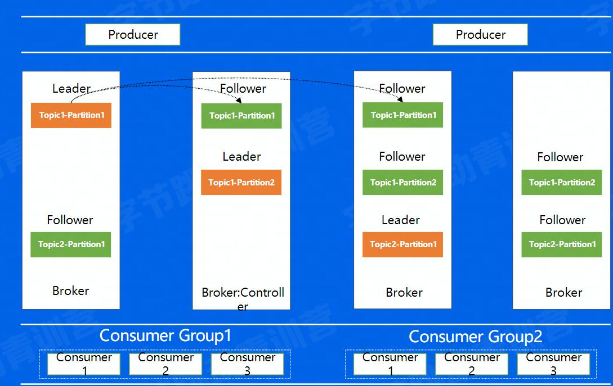
4. kafka架构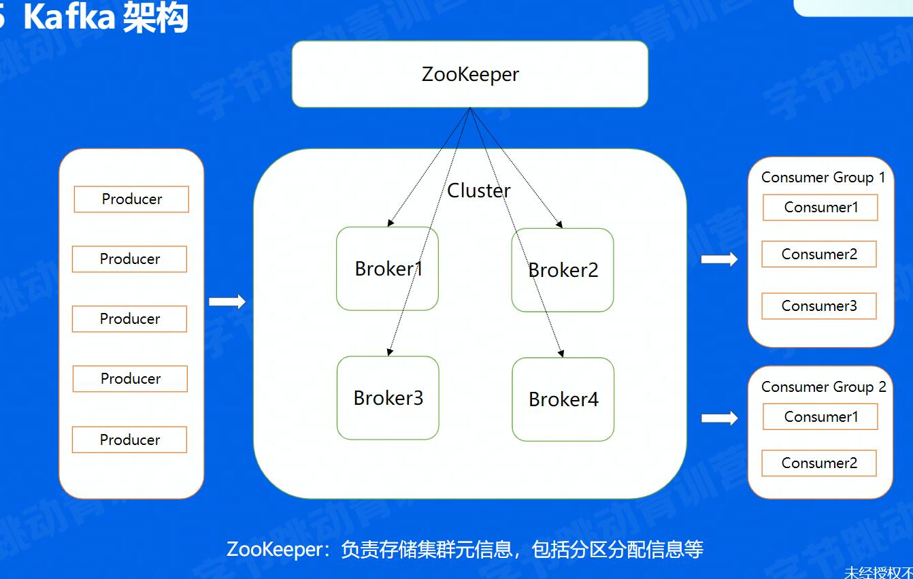
5. Producer
 - 处理高消息量:
   - 将消息挂起, 然后批量发送减少IO次数
   - 数据压缩, 减少消息大小, Snappy,Gzip,LZ4,ZSTD等压缩算法
6. Broker
 - 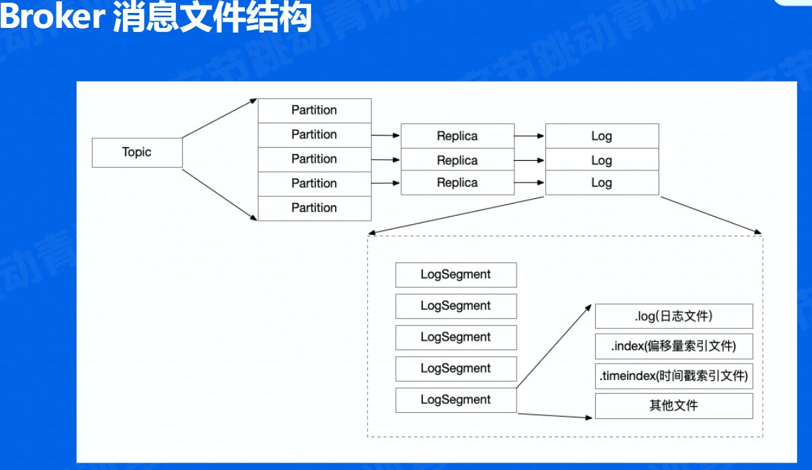
 - 文件存储相关
   - 顺序写
   - 找文件 二分法
 - 数据拷贝 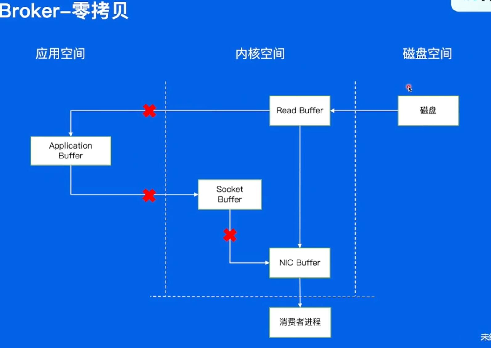
7. Consumer
 - 解决Partition在Consumer Group中的分配问题
   - 手动分配: Consumer消费哪一个Partition完全由业务决定
     - 不能容灾
     - 性能不够的话, 添加Consumer麻烦
   - 自动分配-添加Coordinator(High Level)
     - 简单的来说，就是在我们的Broker集群中，对于不同的Consumer Group来讲，都会选取一台Broker当做Coordinator，而Coordinator的作用就是帮助Consumer Group进行分片的分配，也叫做分片的rebalance，使用这种方式，如果ConsumerGroup中有发生宕机，或者有新的Consumer加入，整个partition和Consumer都会重新进行分配来达到一个稳定的消费状态
     - 几轮请求
       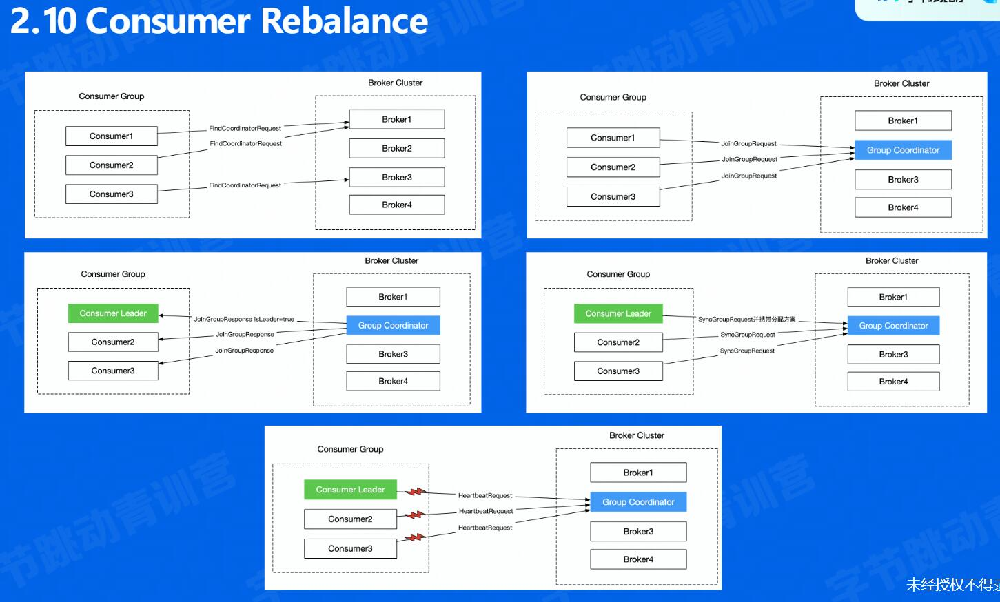
8. kafka缺点
 - 数据复制问题
   - 重启操作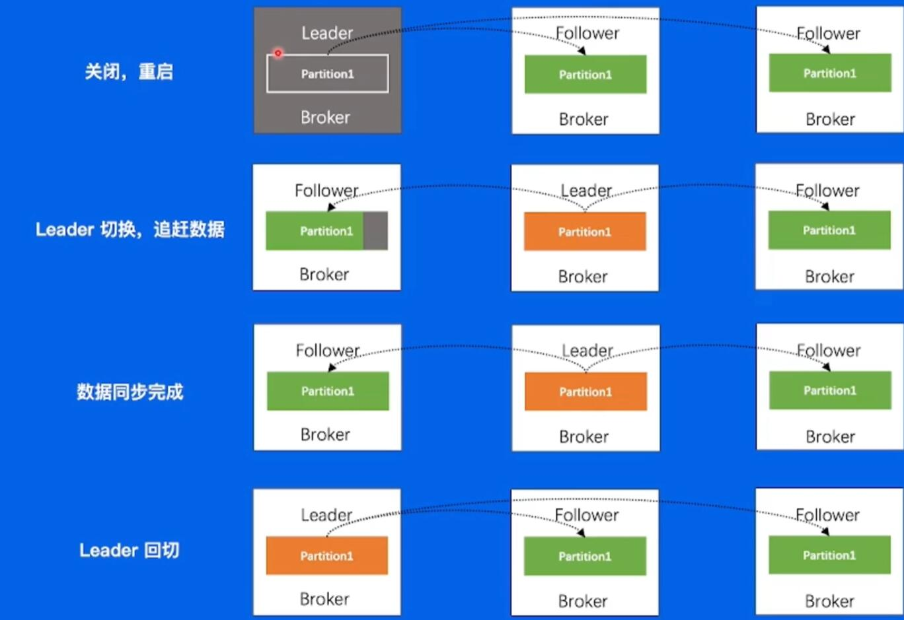
 - 运维成本高
 - 对于负载不均衡的场景,解决方案复杂
 - 没有自己的缓存,完全依赖Page cache
 - Controller 和 Coordinator和Broker在同一进程中, 大量IO会造成性能下降
### 消息队列-BMQ
兼容kafka协议,存算分离,云原生消息队列
1. 架构 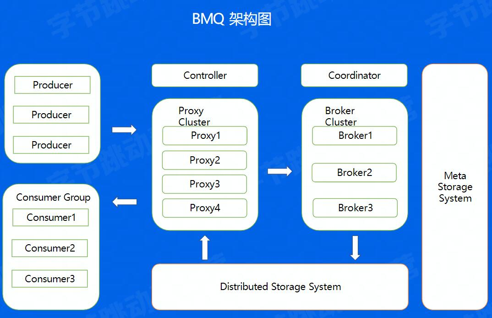
2. 运维操作对比
  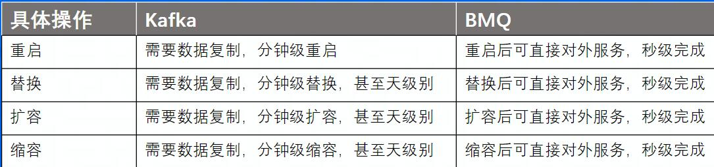
3. HDFS写文件流程
  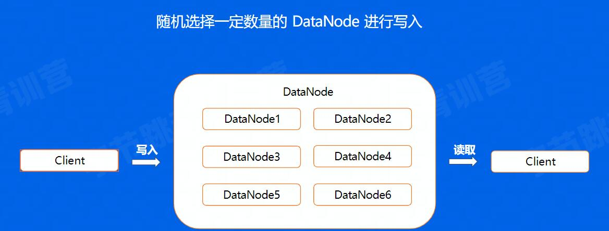
4. BMQ文件结构,对于Kafka分片数据的写入，是通过先在Leader上面写好文件，然后同步到Follower上，所以对于同一个副本的所有Segment都在同一台机器上面。就会存在之前我们所说到的单分片过大导致负载不均衡的问题，但在BMQ集群中，因为对于单个副本来讲，是随机分配到不同的节点上面的，因此不会存在Kafka的负载不均问题
  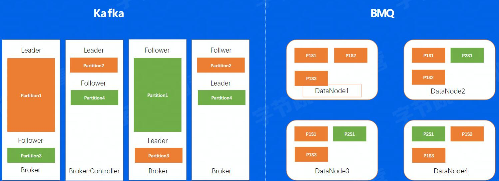
5. Broker
  - Partition状态机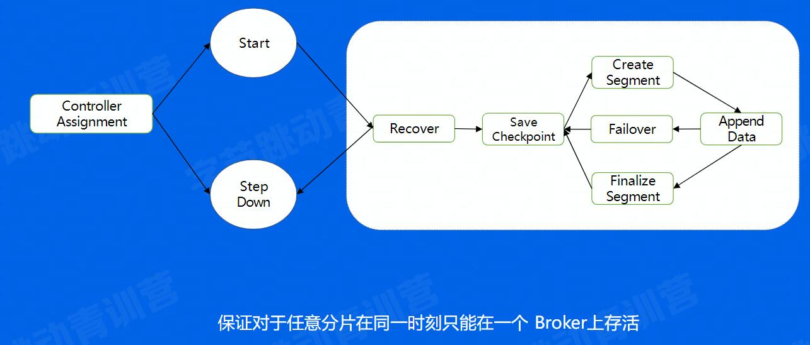
    - 获取分片写入权利，也就是说，对于hdfs来讲，只会允许我一个分片进行写入，只有拿到这个权利的分片我才能写入
    - 如果上次分片是异常中断的，没有进行save checkpoint，这里会重新进行一次save checkpoint，然后就进入了正常的写流程状态，创建文件，写入数据，到一定大小之后又开始建立新的文件进行写入。
  - 写文件流程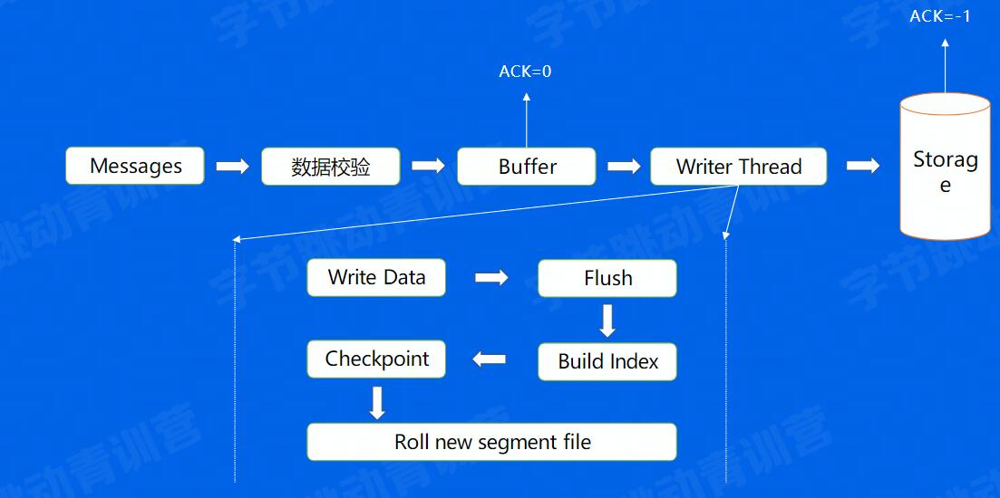
    - 数据校验 : CRC
    - 数据校验：CRC , 参数是否合法 校验完成后，会把数据放入Buffer中 通过一个异步的Write Thread线程将数据最终写入到底层的存储系统当中 这里有一个地方需要注意一下，就是对于业务的写入来说，可以配置返回方式，可以在写完缓存之后直接返回，另外我也可以数据真正写入存储系统后再返回，对于这两个来说前者损失了数据的可靠性，带来了吞吐性能的优势，因为只写入内存是比较快的，但如果在下一次flush前发生宕机了，这个时候数据就有可能丢失了，后者的话，因为数据已经写入了存储系统，这个时候也不需要担心数据丢失，相应的来说吞吐就会小一些 我们再来看看Thread的具体逻辑，首先会将Buffer中的数据取出来，调用底层写入逻辑，在一定的时间周期上去flush，flush完成后开始建立Index，也就是offset和timestamp对于消息具体位置的映射关系 Index建立好以后，会save一次checkpoint，也就表示，checkpoint后的数据是可以被消费的辣，我们想一下，如果没有checkpoint的情况下会发生什么问题，如果flush完成之后宕机，index还没有建立，这个数据是不应该被消费的 最后当文件到达一定大小之后，需要建立一个新的segment文件来写入
    - 写文件Failover
      - 失败后重新寻找正常的节点创建新的文件写入
6. Proxy
  Consumer发送Fetch request, 设置一个wait机制,减少fetch请求的IO次数
7. 多机房部署
  避免机房级故障
8. 高级特性
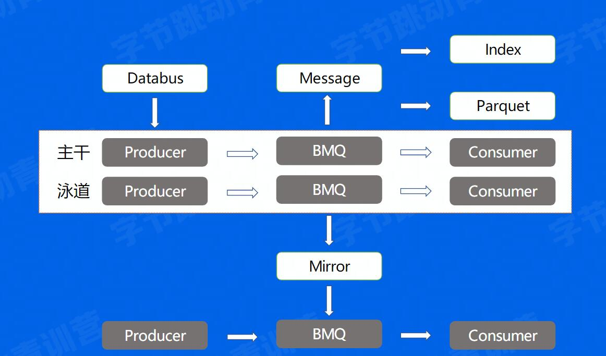
9. 泳道消息
开发流程: 开发->BOE(完全独立的线下机房环境)->PPE(产品预览环境)->Prod
- 测试中的问题  
  - 当多人同时测试, 需等待
  - 多搭建环境并行测试,浪费资源 
  - 对于PPE的消费者来说,资源没有生产环境多,无法承受生产环境的流量
泳道消息:解决主干泳道流量隔离问题以及泳道资源重复创建问题 
10.  Databus
11.  Mirror
实际的业务部署在各种地方-->跨Region读写问题
12.  Index
13.  Parquet
### 消息队列-RocketMQ
电商等
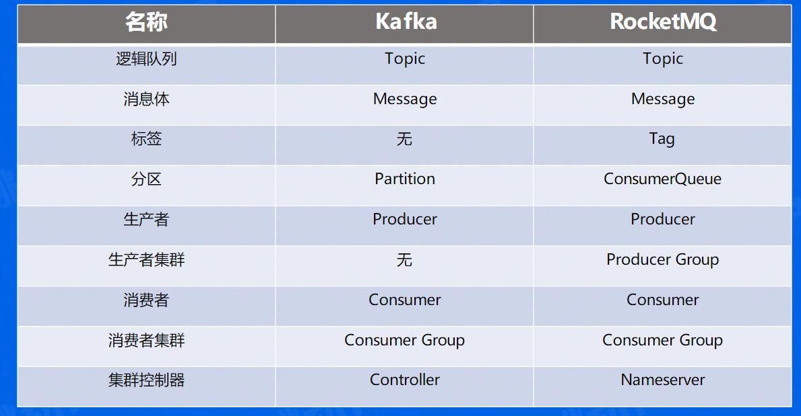