## 分布式定时任务

### 前言
例: 自动化 + 定时执行 + 海量数据 + 高效稳定

### 发展历程
从linux命令到单机到分布式

- windows批处理 -- 设置十分钟后关机  .bat文件
- window任务计划程序 -- 疫情自动打卡
- linux 
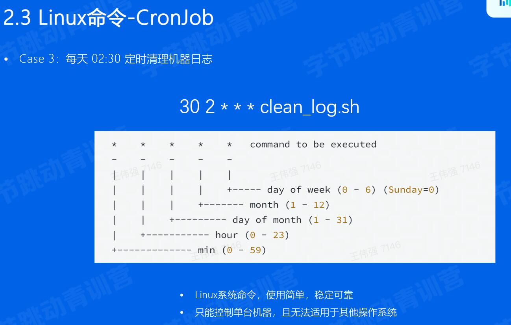
- 单机定时任务 go :ticker
- 任务调度-Quartz
- 分布式定时任务: 前面只支持单机
  - 平台化管理
  - 分布式部署
  - 支持海量数据

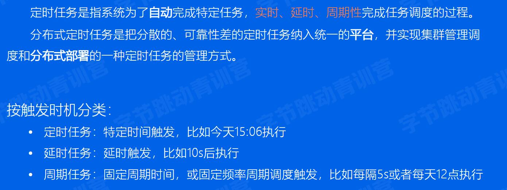

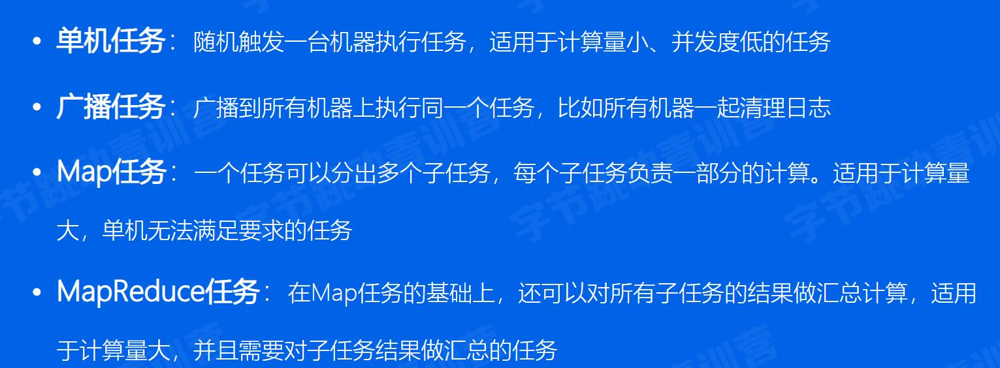
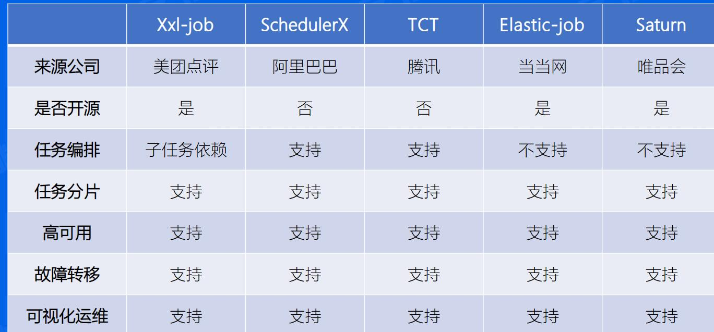

### 实现原理
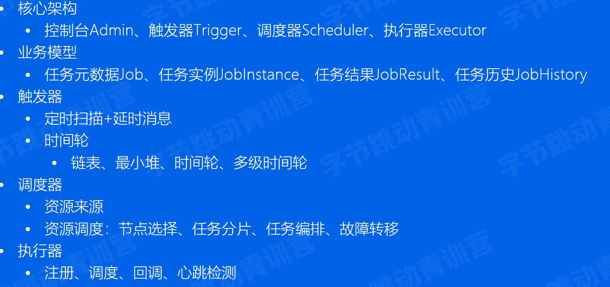
1. 核心架构
   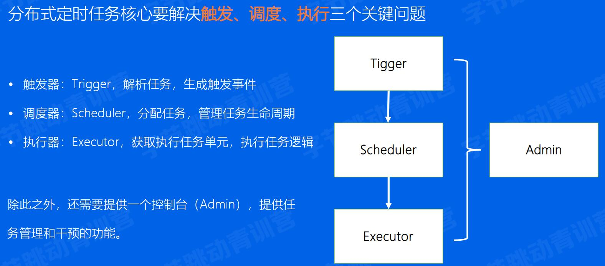
  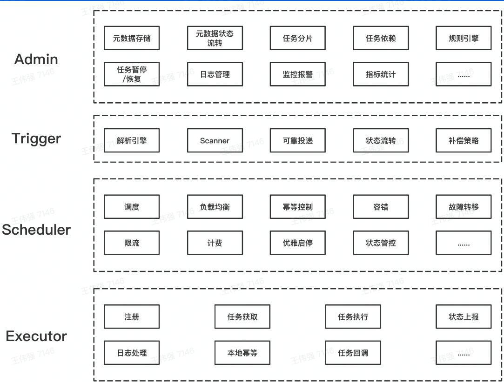
2. 控制台
  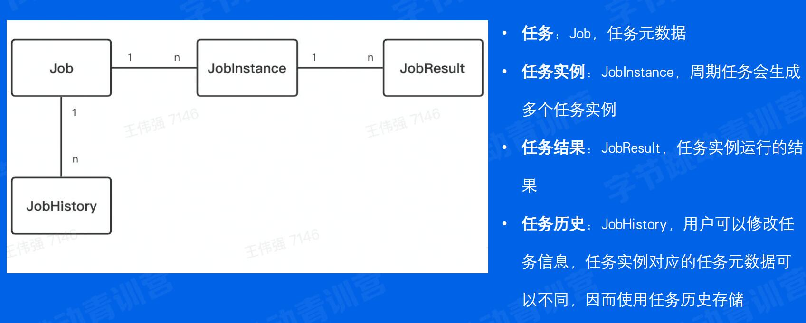
3. 触发器
   核心职责:解析触发规则,在规定的时间点触发任务的调度
  - 方案一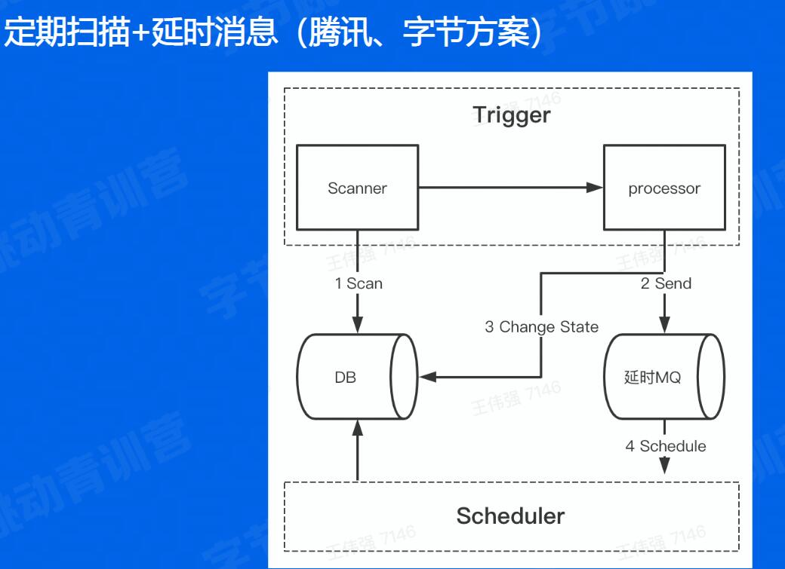
  - 方案2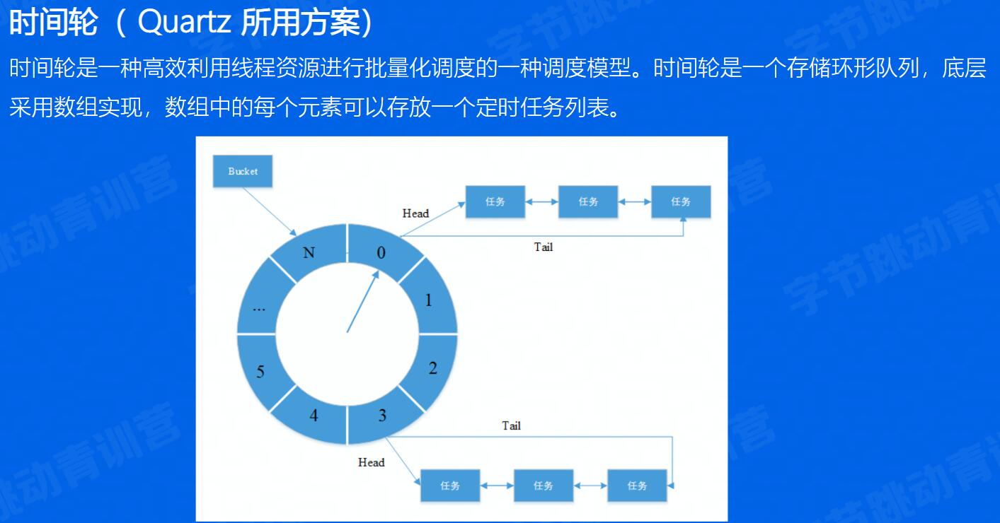
    - 遍历任务列表,选取数据结构
      - 链表:查询O(n),修改O(1)
      - 最小堆:查询O(1),修改O(logn)
      - 时间轮:查询O(1),修改O(1) 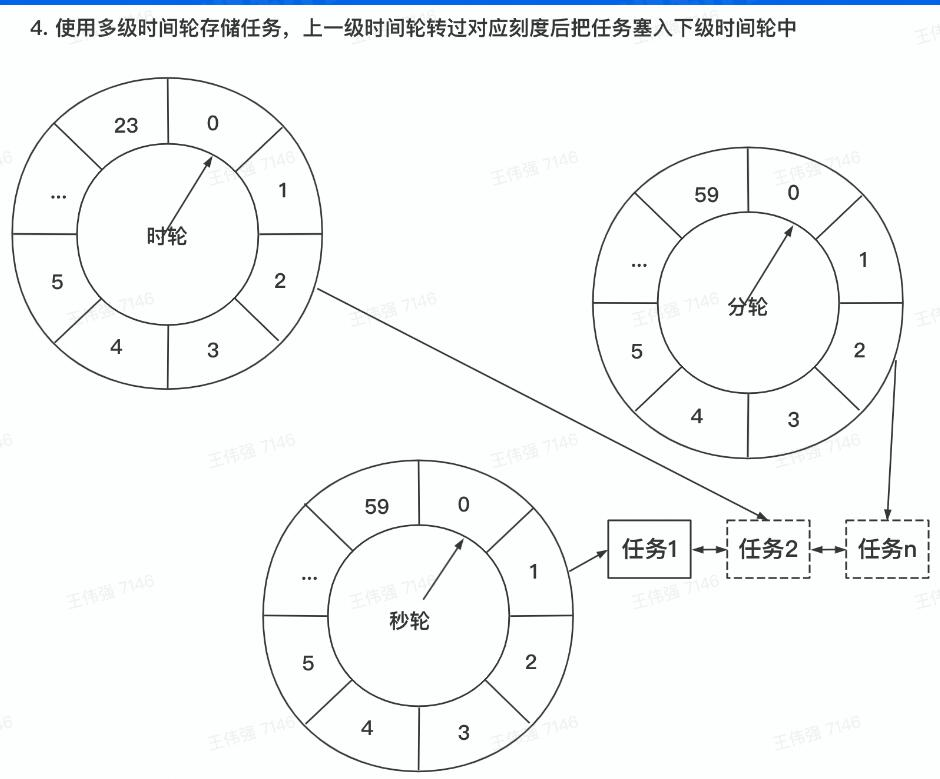
    - 高可用:不同业务之间, 任务的调度相互影响`or`负责扫描和触发的机器挂了怎么办?
      - 存储上,不同国别、业务做资源隔离
      - 分开运行
      - 多机房多trigger集群化部署,避免单点故障,需避免同一任务被多次触发, 通过数据锁或分布式锁
      - 数据库行锁
        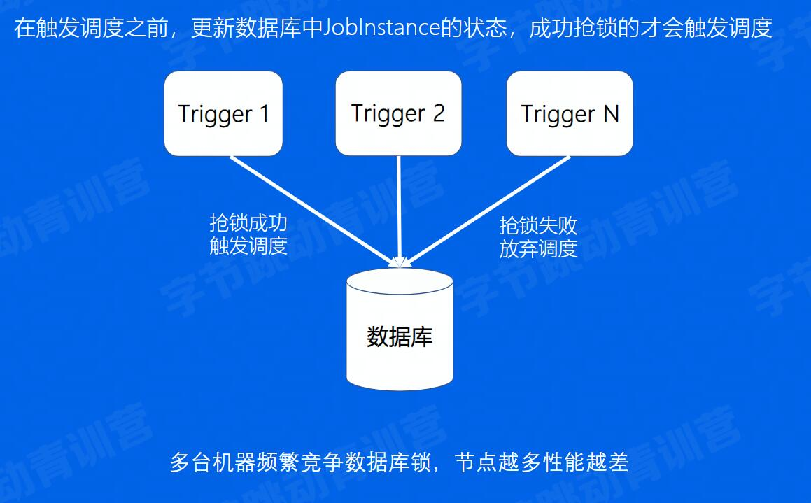
      - 分布式锁
        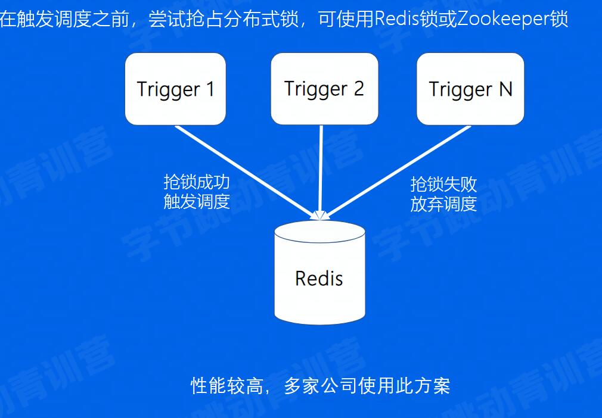
4. 调度器
   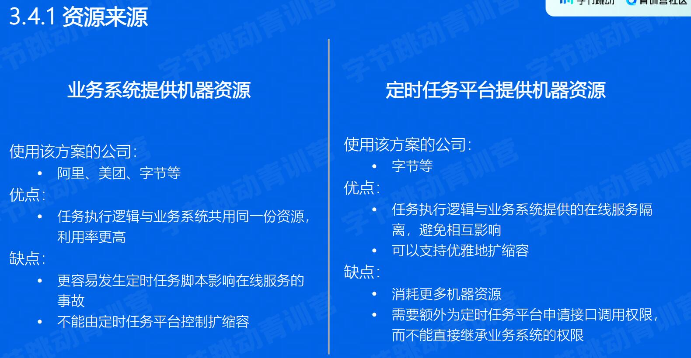
   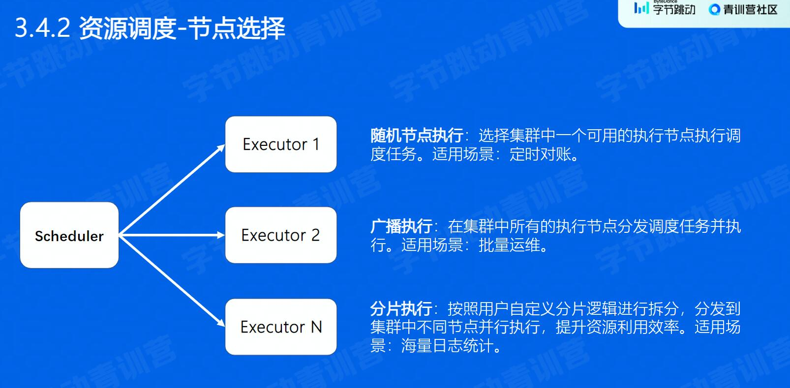
   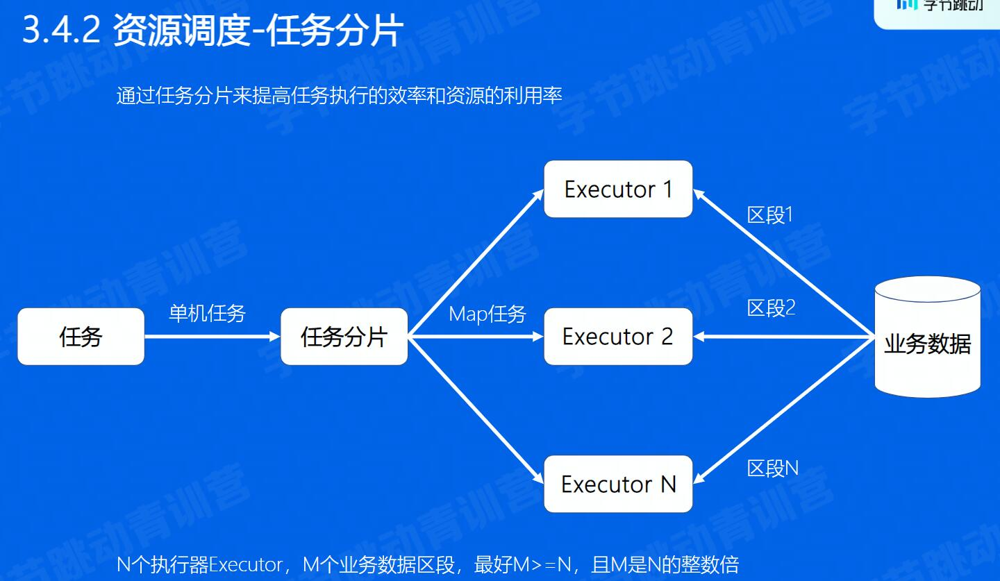
   任务编排:用有向无环图
   
5. 执行器

### 业务应用