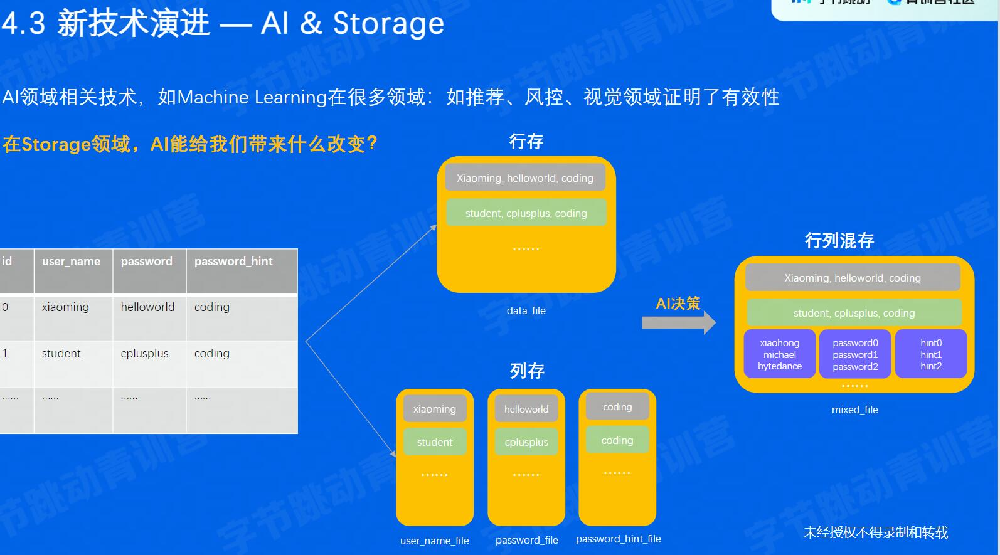

## 存储&数据库

### 经典案例
数据的流动

数据的持久化

- 潜在的问题
  - 数据库怎么保证数据不丢失
  - 怎么处理多人同时修改的问题
  - 除了数据库还能用别的存储系统吗
  - 数据库只能处理结构化数据吗
  - 有哪些操作数据库的方式,要用什么编程语言
### 简介
**存储系统**:一个提供了读写、控制类接口,能够安全有效的把数据持久化的软件

- 系统特点
  - 性能敏感
  - 存储系统软件架构,容易受到硬件影响

1. RAID
  Redundant Array of Inexpensive Disks
  
2. 数据库
  - 关系型数据库
    - 结构化数据友好
    - 支持事务(ACID)
    - 支持复杂查询语言 
  - 非关系型数据库
    - 上面变成 有可能
3. 对比
   
   
   
4. 数据库使用方式
   DSL(dimain specific language)

### 主流产品剖析
1. 单机存储
   - 本地文件系统
    
   - kv存储
     - 常见使用方式 put(k,v), get(k)
     - 常见数据结构:LSM-tree, 某种程度牺牲读性能,追求写入性能
2. 分布式存储
   - HDFS
    
   - Ceph
    
3. 单机数据库
   1. 关系型:商业Oracle,  开源:mysql postgreSql
   2. 非关系:MongoDB, redis, elasticsearch
4. 分布式数据库
   why:容量 弹性  性价比
   - 容量:
   - 弹性:
   - 性价比:
  more to do: 单写vs多写,从磁盘弹性到内存弹性,分布式事务优化

### 新技术演进

