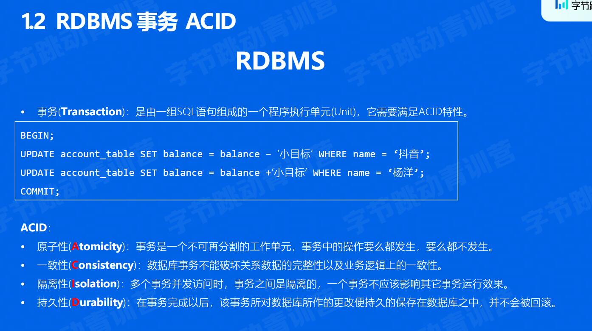
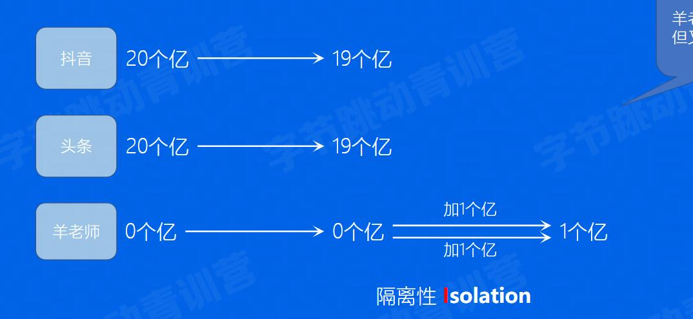
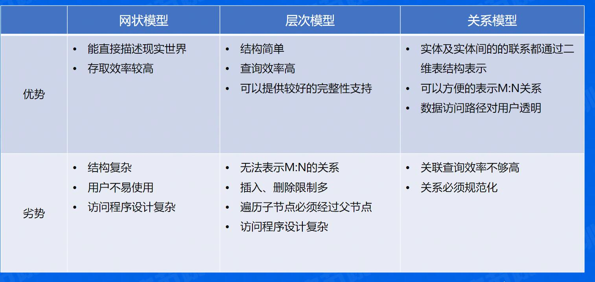
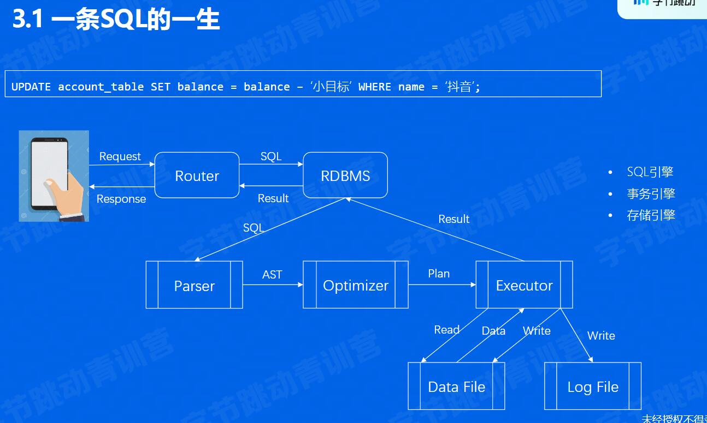
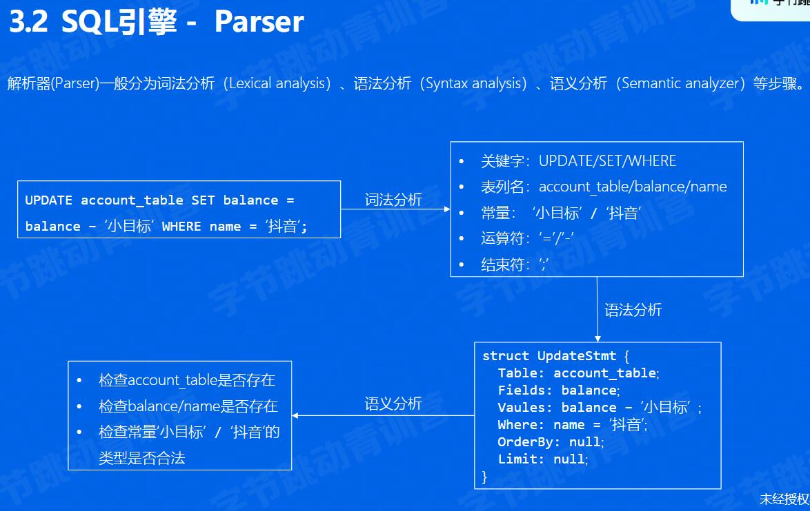
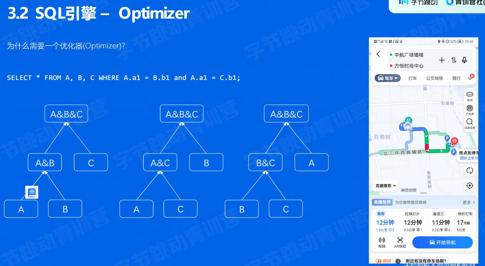
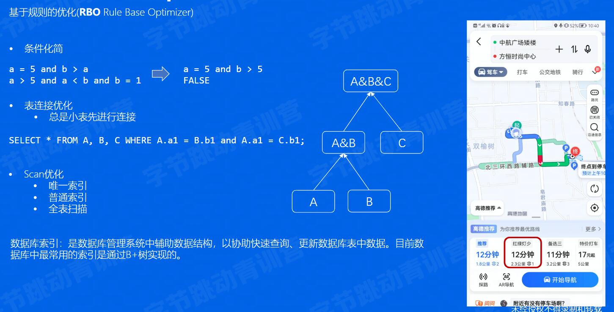
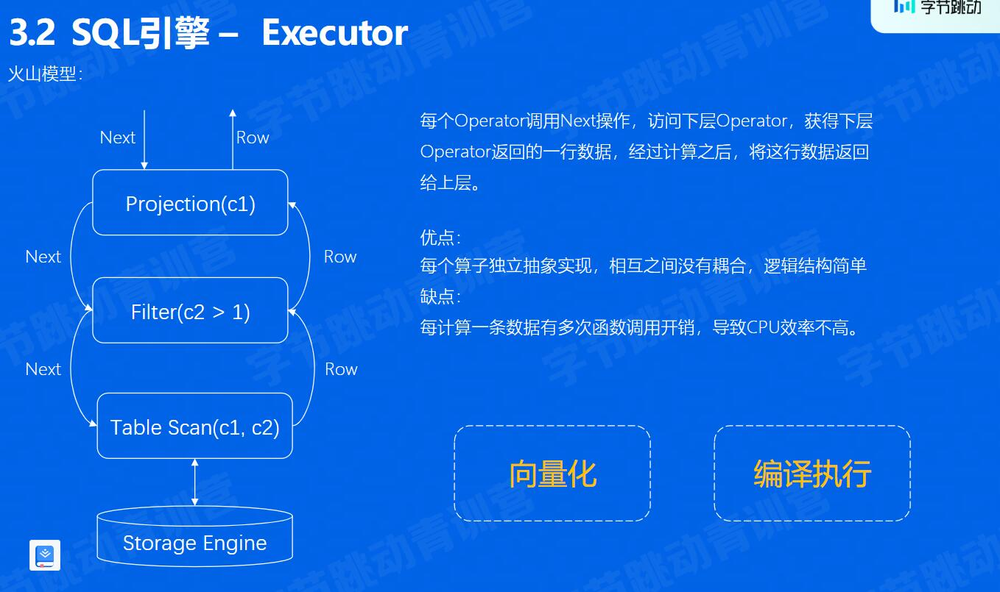
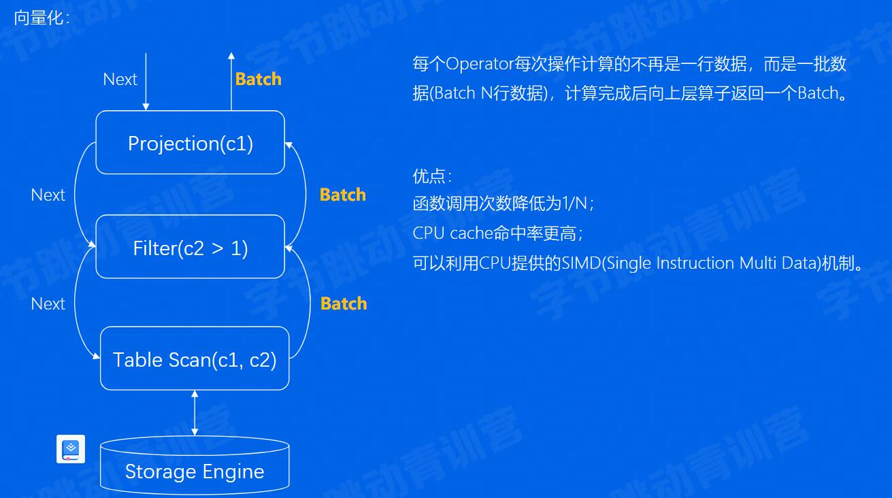
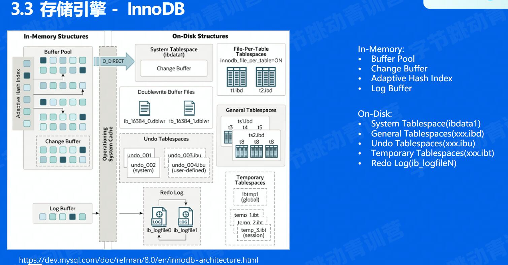

## 关系型数据库

### 经典案例

红包雨中金钱的转移问题

Atomicity : 两个操作(20->19, 0->1)要么同时成功, 要么同时失败, 不存在中间态
Consistency: 每个操作必须是合法的,账户信息应该从一个有效的状态变为另一个有效的状态(0.5->-0.5(非法))
Isolation: 两个操作对同一个账户并发操作时,应该时互不影响,表现的像是串行操作

- 需求
  - 高并发
  - 高可靠
### 发展历史
1. 人工管理: 类似自己记账
2. 文件系统
3. DBMS时代
  - 网状模型DBMS : 网
  - 层次模型DBMS : 树
  - 关系模型
4. DBMS数据模型
  
5. SQL语言
  1974年两个人将Codd关系数据库的12条准则的数学定义表示出来, 提出了SQL(Structured Query Language)
### 关键技术
1. 一条SQL的一生
  - 查询解析: 将文本解析成结构化数据, 即抽象语法树(AST)
  - 查询优化: 优化器的作用是根据AST产生最优执行计划(Plan Tree)
  - 查询执行: 根据查询计划，完成数据读取、处理、写入等操作。
  - 事务引擎: 处理事务一致性、并发、读写隔离等 
  - 存储引擎：内存中的数据缓存区、数据文件、日志文件
2. 
   1. Parser
    所有的代码在执行之前，都存在一个解析编译的过程，差异点无非在于是静态解析编译还是动态的。 SQL语言也类似，在SQL查询执行前的第一步就是查询解析。 
     - 词法分析：将一条SQL语句对应的字符串分割为一个个token，这些token可以简单分类。 
     - 语法分析：把词法分析的结果转为语法树。根据tocken序列匹配不同的语法规则，比如这里匹配的是update语法规则，类似的还有insert、delete、select、create、drop等等语法规则。根据语法规则匹配SQL语句中的关键字，最终输出一个结构化的数据结构。 
     - 语义分析：对语法树中的信息进行合法性校验。
   2. Optimizer
      - 基于规则的优化
      - 基于代价的优化对于InnoDB 存储引擎来说，全表扫描的意思就是把聚簇索引中的记录都依次和给定的搜索条件做一下比较，把符合搜索条件的记录加入到结果集，所以需要将聚簇索引对应的页面加载到内存中，然后再检测记录是否符合搜索条件。 对于使用二级索引 + 回表方式的查询，设计MySQL 的大叔计算这种查询的成本依赖两个方面的数据：范围区间数量，需要回表数据量
   3. Executor
      向量化
      编译执行:LLVM动态编译技术:代码生成之后数据库运行时仍然是一个 for 循环，只不过这个循环内部的代码从简单的一个虚函数调用plan.next()展开成了一系列具体的运算逻辑，这样数据就不用再各个 operator 之间进行传递，而且有些数据还可以直接被存放在寄存器中，进一步提升系统性能。整个操作有点像inline 函数，把所有的操作inline到一个函数中去。 LLVM动态编译执行技术，根据优化器产生的计划，动态的生成执行代码。
3. 存储引擎
   1. InnoDB

### 企业实践