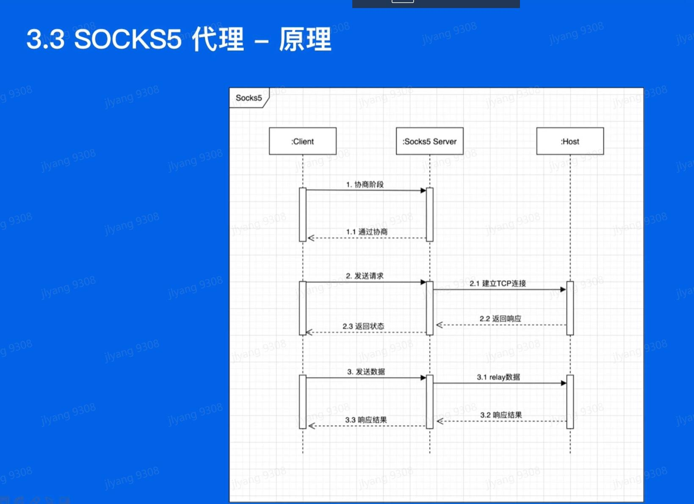

## go基础语法

### 字符串操作

```go

import "strings"

  a := "hello"
  strings.Contains(a, "ll")    // true
  strings.Count(a, "l")        // 2
  strings.HasPrefix(a, "he")   // true
  strings.HasSuffix(a, "llo")  // true
  strings.Index(a, "ll")       // 2
  strings.Join([]string{"he", "llo"}, "-") // he-llo
  strings.Repeat(a, 2)         // hellohello
  strings.Replace(a, "e", "E", -1)  // hEllo
  strings.Split("a-b-c", "-")  // [a b c]
  strings.ToLower(a)           // hello
  strings.ToUpper(a)           // HELLO
```


### 格式化输出

```go

fmt.Printf("p = %v\n", p)
fmt.Printf("p = %+v\n", p)   // 详细信息 
fmt.Printf("p = %#v\n", p)   // 更详细的信息
```

### json处理 

```go
  var b userInfo
  err = json.Unmarshal(buf, &b) 
```


### 进程信息

```go

import (
  "fmt"
  "os/exec"
  "os"
)


func main(){
  fmt.Println(os.Args)
  fmt.Println(os.Getenv("PATH"))
  fmt.Println(os.Setenv("AA", "BB"))

  buf, err := exec.Command("grep", "127.0.0.1", "etc/hosts").CombinedOutput()
  if err != nil{
    panic(err)
  }

  fmt.Println(string(buf))  // 127.0.0.1
}
```

### fmt的特殊情况
- String()
- Error()

error
```go
package main

import (
	"fmt"
	"time"
)

type MyError struct {
	When time.Time
	What string
}

func (e *MyError) Error() string {
	return fmt.Sprintf("at %v, %s",
		e.When, e.What)
}

func run() error {
	return &MyError{
		time.Now(),
		"it didn't work",
	}
}

func main() {
	if err := run(); err != nil {
		fmt.Println(err)
	}
}


package main

import (
	"fmt"
)

type ErrNegativeSqrt float64

func (e ErrNegativeSqrt) Error() string {
	return fmt.Sprintf("cannot Sqrt negative number: %v", float64(e))
}

func Sqrt(x float64) (float64, error) {
	if x >= 0 {
		return 0, nil

	}
	return 0, ErrNegativeSqrt(x)
}

func main() {
	fmt.Println(Sqrt(2))
	fmt.Println(Sqrt(-2))
}

```
在 Error 方法内调用 fmt.Sprint(e) 会让程序陷入死循环。可以通过先转换 e 来避免这个问题：fmt.Sprint(float64(e))。这是为什么呢？  

e用error产生了error??吧


string
```go 
package main

import "fmt"

type IPAddr [4]byte

// TODO: 给 IPAddr 添加一个 "String() string" 方法
func (addr IPAddr) String() string {
	return fmt.Sprintf("%v.%v.%v.%v", addr[0], addr[1], addr[2], addr[3])
}

func main() {
	hosts := map[string]IPAddr{
		"loopback":  {127, 0, 0, 1},
		"googleDNS": {8, 8, 8, 8},
	}
	for name, ip := range hosts {
		fmt.Printf("%v: %v\n", name, ip)
	}
}

```

### io.reader
```go
package main

import (
	"io"
	"os"
	"strings"
)

type rot13Reader struct {
	r io.Reader
}

func (rot *rot13Reader) Read(p []byte) (n int, err error) {
    n,err = rot.r.Read(p)
    for i := 0; i < len(p); i++ {
        if (p[i] >= 'A' && p[i] < 'N') || (p[i] >='a' && p[i] < 'n') {
            p[i] += 13
        } else if (p[i] > 'M' && p[i] <= 'Z') || (p[i] > 'm' && p[i] <= 'z'){
            p[i] -= 13
        }
    }
    return
}


func main() {
	s := strings.NewReader("Lbh penpxrq gur pbqr!")
	r := rot13Reader{s}
	io.Copy(os.Stdout, &r)
}


```

### chan 管道 等价二叉查找树
```go
package main

import "golang.org/x/tour/tree"
import "fmt"

// Walk walks the tree t sending all values
// from the tree to the channel ch.
func Walk(t *tree.Tree, ch chan int) {
    _walk(t, ch)
    close(ch)
    
}
 
func _walk(t *tree.Tree, ch chan int) {
    if t != nil {
        _walk(t.Left, ch)
        ch <- t.Value
        _walk(t.Right, ch)
    }
}
 
// Same determines whether the trees
// t1 and t2 contain the same values.
func Same(t1, t2 *tree.Tree) bool {
    ch1 := make(chan int)
    ch2 := make(chan int)
    go Walk(t1, ch1)
    go Walk(t2, ch2)
    for i := range ch1 {
        if i != <- ch2 {
            return false
        }
    }
    return true    
}
 
func main() {
    //tree.New(2)
    ch := make(chan int)
    go Walk(tree.New(1), ch)
    for v := range ch {
        fmt.Print(v)
    }
    fmt.Println(Same(tree.New(1), tree.New(1)))
    fmt.Println(Same(tree.New(1), tree.New(2)))
}
```


### 锁的应用以及并发 `注意每个锁的释放必须被执行`
```go

package main

import (
	"fmt"
	"sync"
)

type Fetcher interface {
	// Fetch 返回 URL 的 body 内容，并且将在这个页面上找到的 URL 放到一个 slice 中。
	Fetch(url string) (body string, urls []string, err error)
}

var fetched map[string]bool
var mapMux sync.Mutex

// Crawl 使用 fetcher 从某个 URL 开始递归的爬取页面，直到达到最大深度。
func Crawl(url string, depth int, fetcher Fetcher) {
	// TODO: 并行的抓取 URL。

	// TODO: 不重复抓取页面。
	// 下面并没有实现上面两种情况：
	if depth <= 0 {
		return
	}
	mapMux.Lock()

	if fetched[url] == true {
		mapMux.Unlock()   // this line is very important
		return
	}
	fetched[url] = true
	mapMux.Unlock()

	body, urls, err := fetcher.Fetch(url)
	if err != nil {
		fmt.Println(err)
		return
	}
	fmt.Printf("found: %s %q\n", url, body)

	var wg sync.WaitGroup
	for _, u := range urls {
		wg.Add(1)
		go func(u string) {
			Crawl(u, depth-1, fetcher)
			wg.Done()
		}(u)
	}
	wg.Wait()
	return
}

func main() {
	fetched = make(map[string]bool)
	Crawl("https://golang.org/", 4, fetcher)
}

// fakeFetcher 是返回若干结果的 Fetcher。
type fakeFetcher map[string]*fakeResult

type fakeResult struct {
	body string
	urls []string
}

func (f fakeFetcher) Fetch(url string) (string, []string, error) {
	if res, ok := f[url]; ok {
		return res.body, res.urls, nil
	}
	return "", nil, fmt.Errorf("not found: %s", url)
}

// fetcher 是填充后的 fakeFetcher。
var fetcher = fakeFetcher{
	"https://golang.org/": &fakeResult{
		"The Go Programming Language",
		[]string{
			"https://golang.org/pkg/",
			"https://golang.org/cmd/",
		},
	},
	"https://golang.org/pkg/": &fakeResult{
		"Packages",
		[]string{
			"https://golang.org/",
			"https://golang.org/cmd/",
			"https://golang.org/pkg/fmt/",
			"https://golang.org/pkg/os/",
		},
	},
	"https://golang.org/pkg/fmt/": &fakeResult{
		"Package fmt",
		[]string{
			"https://golang.org/",
			"https://golang.org/pkg/",
		},
	},
	"https://golang.org/pkg/os/": &fakeResult{
		"Package os",
		[]string{
			"https://golang.org/",
			"https://golang.org/pkg/",
		},
	},
}

```


### 实战
- 猜数字游戏
- 在线字典
  - 生成一个请求
  - 观察network payload <curlconverter.com>
  - 观察network preview <oktools.net/json2go>
- socks5代理



