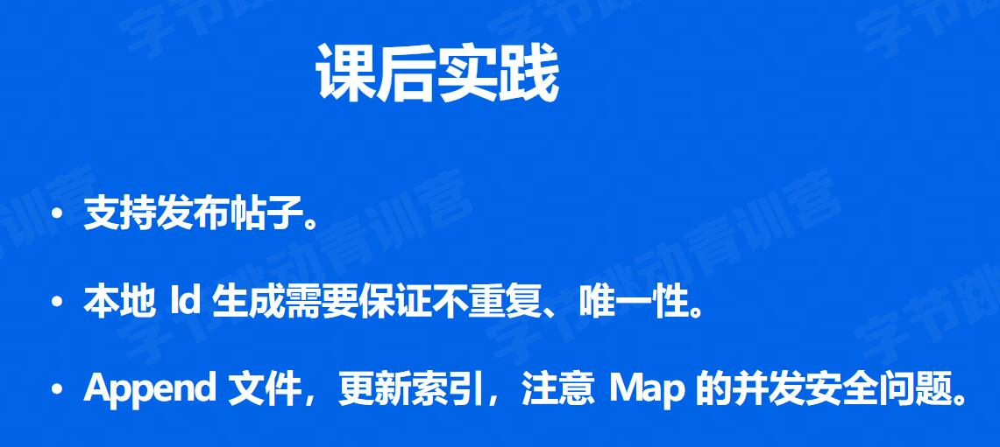

## 工程实践

### 并发编程

并发  单核  时间片切换

并行  多核

- 线程
  - 内核 
- 协程
  - 用户态

管道 channel -- make
无缓冲通道(同步通道) make(chan int)  
> 消费者的消费速度, 有种情况是 生产者一直往chan里放数据

有缓冲通道 make(chan int, 2)

sync

### 依赖管理   自己再找点东西

GOPATH  --> Go Vendor --> Go Module

- gopath
  - 无法实现多版本控制, 所有的项目都依赖于src文件
- govendor
  - 增加一个优先级更高的 vendor文件, 先去vendor文件夹寻找源码,再去gopath
- go mod依赖管理三要素
  - 配置文件 go.mod
  - 中心仓库管理依赖库 依赖分发-proxy
  - 本地工具 go mod/ go get
    - go mod init
    - go mod download
    - go mod tidy

### 单元测试

- 回归测试
- 集成测试
- 单元测试

测试文件以_test.go结尾

func TestXxx(*testing.T)

初始化逻辑放到TestMain中

### 项目实战

