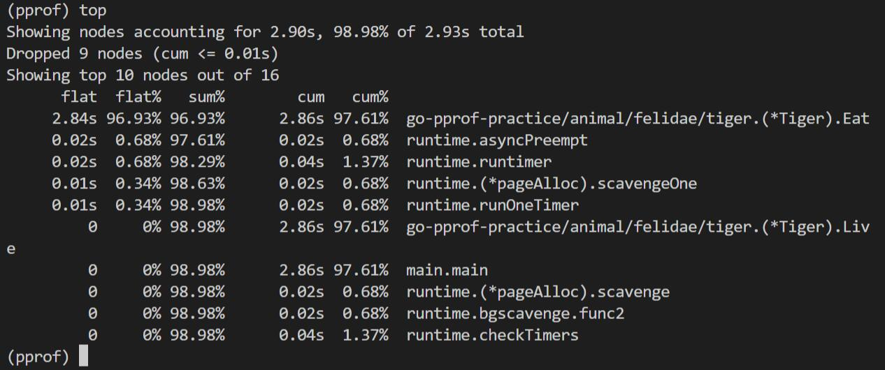
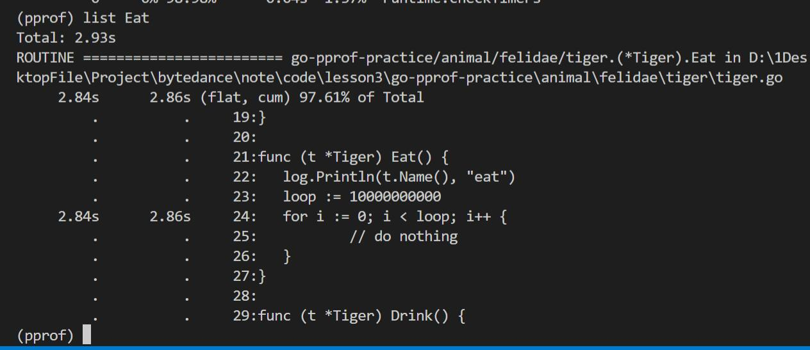
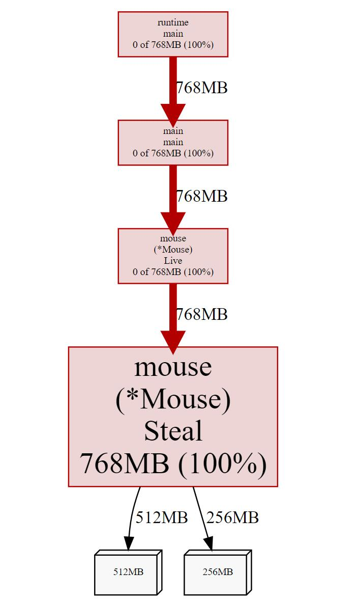

## 高质量编程与性能调优实战

### 注释

### 命名 

缩略词全大写(处于开头时, 且不公开可以全小写)
- ServerHTTP
- httpRequest

### 错误和异常
- error
- panic
- recover

### 性能优化 - Benchmark

预分配减少分配和内存拷贝的消耗
- 切片  map

copy(result, origin[len(origin)-2:])

- 字符串处理
  - +: 字符串不可变, 每次+都会开辟新的空间 
  - strings.Builder (最快)
  - ByteBuffer

- 空结构体

- 多线程编程 使用 atomic 包

### 性能调优实战
原则
- 依赖数据而非猜测
- 定位最大瓶颈而非细枝末节
- 不要过早优化
- 不要过度优化

#### 性能分析工具 pprof

pprof 界面 <http://localhost:6060/debug/pprof/>

1. 时间方面
   
启动  
`go tool pprof "http://localhost:6060/debug/pprof/profile?seconds=10"`

- top 命令 查看消耗资源最多的函数

flat函数本身的消耗, cum函数及其调用函数的消耗
flat == cum 函数中没有调用其他函数
flat == 0  函数全调用其他函数了

- list [函数]  查看某个函数的情况

- web 生成调用图

2. 堆内存 

`go tool pprof -http=:8080 "http://localhost:6060/debug/pprof/heap"`

打开一个界面

3. goroutine

#### 业务服务优化
