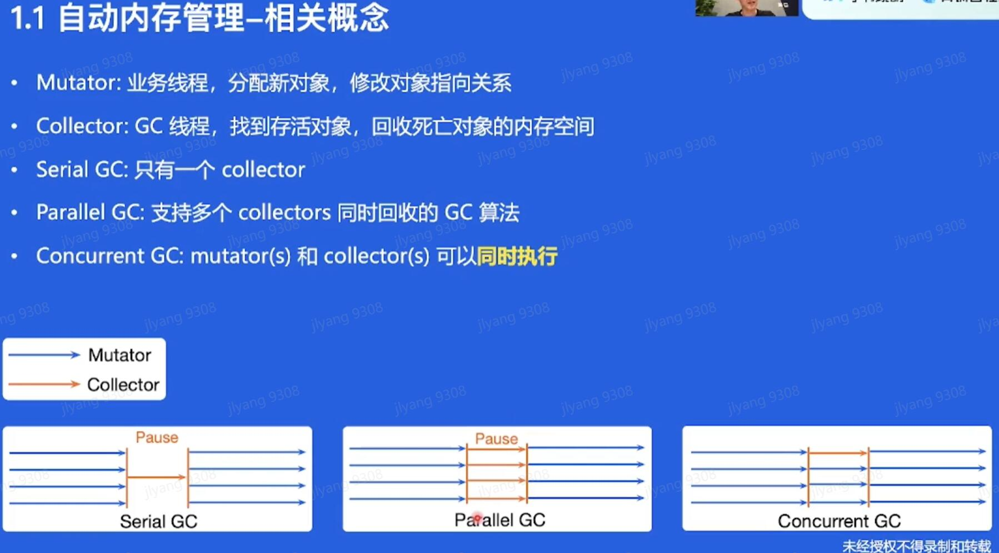
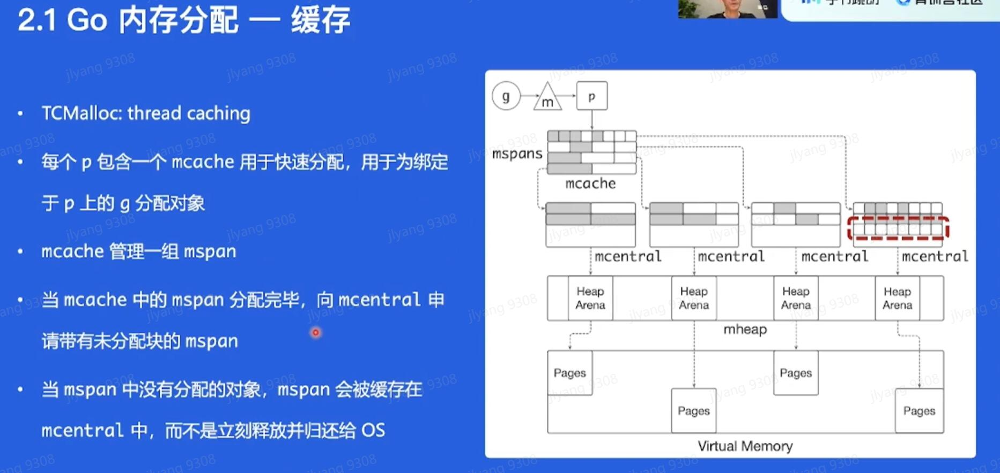
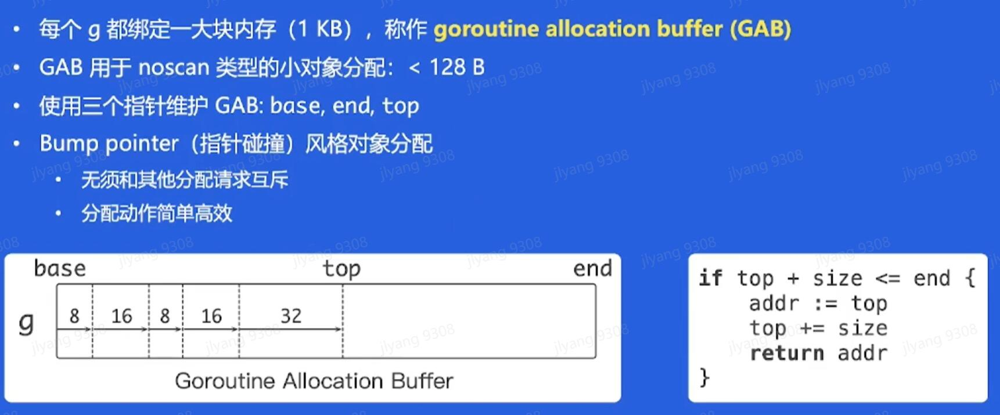

## go-lang优化与落地实践

性能优化 :
- 业务方面
- 语言运行时

可维护性:
- 测试用例
- 文档
- 隔离
- 可观测性 : 必要的日志输出

### 自动内存管理

- Tracing garbage collection
  - Copying GC
  - mark-sweep gc
  - marl-compact gc
- generation gc
- Reference counting

Mutator : 业务线程, 分配新对象,修改对象指向关系
Collector : GC线程, 找到存活对象, 回收死亡对象的内存空间
Serial GC: 就一个Collector   有pause(暂停)
Parallel GC : 多个Collector同时回收 有pause(暂停)
Concurrent GC : mutator和collector可以同时运行, **但collector必须感知对象指向关系的改变**

### go内存管理及优化

内存管理优化
- 对象分配是高频的操作
- 小对象占比高
- go内存分配比较耗时
  - 分配路径长: g -> m -> p -> mcache -> mspan -> mem block -> return pointer

优化方案: balanced gc

有个缺点: gab中一个存活的小对象会把整个大的gab都标记为被引用
解决: 类似  copying GC的算法, gab总大小超过一定阈值时, 将存活的对象复制到另外分配的gab中

### 编译器和静态分析

### go编译器优化

用编译时间换取更高效的二进制机器码

- 函数内联

- 逃逸分析
  - 分析代码中指针的动态作用域: 指针在何处可以被访问(有没有逃出当前的作用域)
  - beast mode : 函数内联扩展了函数的边界, 更多对象不逃逸
  - 优化: 未逃逸的对象可以在**栈上分配**
    - 栈上对象回收和分配:移动sp
    - 减少在heap上的分配, 降低GC负担