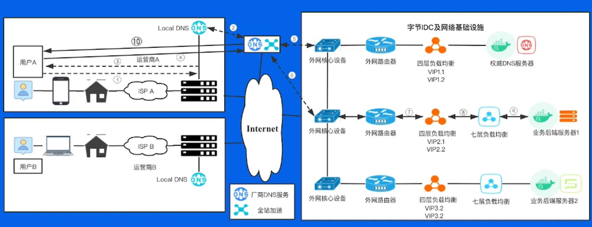
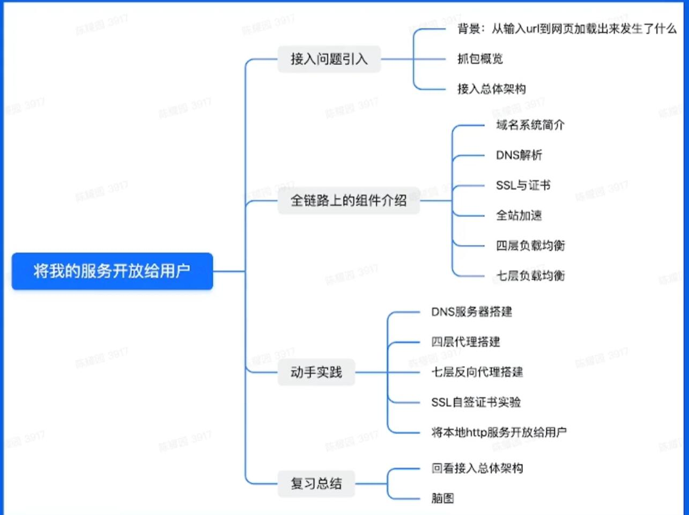
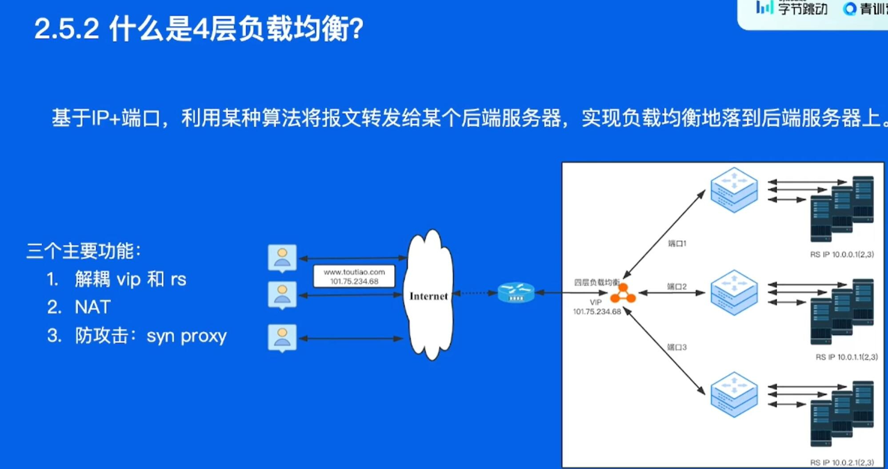
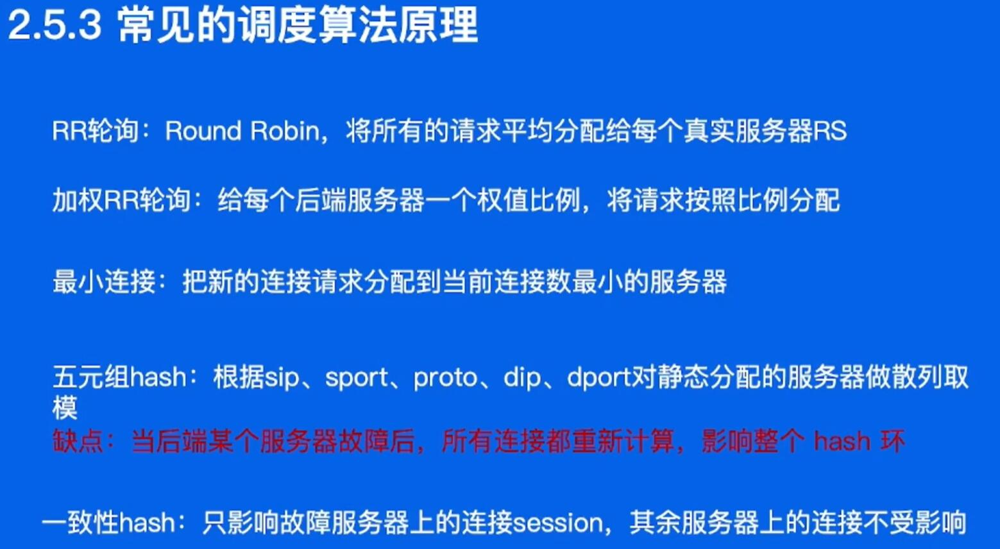

## 将我的服务开放给用户

### 域名系统

host访问 负载大

### 自建DNS系统

- 使用外部DNS系统的缺点

DNS查询, 每次从根域名服务器查, 查完缓存到本地

### 接入HTTPS协议

#### 问题背景
  - 访问403
  - 出席那奇怪的东西
  - 信息泄露

原因: HTTP明文传输, 中间商篡改信息

#### 对称加密和非对称加密

- 对称加密: 一份密钥
- 非对称加密: 公钥和私钥

#### SSL的通信过程

#### 证书链

#### 使用https

### 接入全站加速

#### 背景
- 源站容量低, 可承载的并发请求数低
- 报文经过的网络设备越多, 出问题的概率越大, 丢包、劫持、mtu问题
- 自主选路网络链路长, 时延高

#### 解决问题

- 源站容量问题: 增加后端机器扩容; 静态内容, 使用静态加速CDN
- 网络传输问题: 动态加速DCDN
- 全站加速: 静态+动态

### 4层负载均衡

#### 常见的实现方式FULLNAT

### 7层负载均衡

#### Nginx

- 事件驱动模型
- 异步非阻塞

